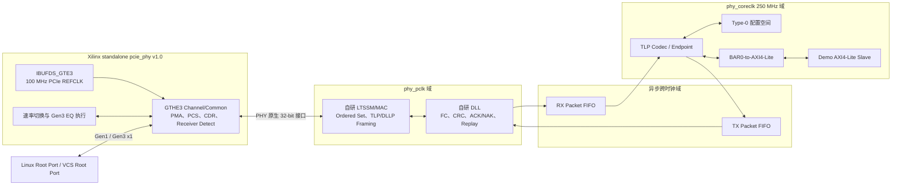

# KCU105/KU040 Endpoint 总体架构

状态：**K00-v1 冻结**  
目标器件：`xcku040-ffva1156-2-e`  
目标链路：PCIe Gen3 x1 Endpoint

## 1. 数据路径与自研边界

文字数据路径固定为：

`PCIe 串行口 → Xilinx standalone pcie_phy → PHY32 → 自研 LTSSM/MAC → 自研 DLL → 异步 Packet FIFO → TLP/配置空间 → BAR-to-AXI4-Lite`

standalone PHY 是唯一的 Xilinx PCIe 相关 IP。它不提供 Endpoint、LTSSM、DLL、
TLP、配置空间、BAR 或 DMA。自研逻辑不直接操作 GTHE3 原语，也不重复实现
8b/10b、128b/130b、CDR、Receiver Detect 和模拟均衡执行。

第一版不实现 DMA、MSI/MSI-X、AER、ASPM、SR-IOV、x4、多 Function 和主动
Memory Request。

## 2. 板级资源

| 资源 | KCU105 管脚/位置 | 用途 |
|---|---|---|
| PCIe Lane 0 RX | `AB2/AB1` | `pcie_rxp/n` |
| PCIe Lane 0 TX | `AC4/AC3` | `pcie_txp/n` |
| PCIe REFCLK | `AB6/AB5` | 100 MHz，Quad 225 MGTREFCLK0 |
| PERST# | `K22` | LVCMOS18，低有效 |
| GT Channel | `GTHE3_CHANNEL_X0Y4` | Lane 0 |
| GT Common | `GTHE3_COMMON_X0Y1` | QPLL1 |

KCU105 的 `J74` 必须短接 1、2 脚以选择 x1。`G10/F10` 的 300 MHz 差分时钟
不进入 Endpoint 顶层或时钟树。

## 3. 时钟域与复位域

- `phy_pclk`：PHY、LTSSM/MAC 和 DLL 的链路域，频率随速率变化；
- `phy_coreclk`：固定 250 MHz，供 TL、配置空间、BAR 和 AXI4-Lite；
- `phy_userclk`：保留并约束，第一阶段不驱动自研协议逻辑；
- `phy_mcapclk`：PHY 输出但第一版不使用。

PCIe REFCLK 经 `IBUFDS_GTE3` 分成：`O → phy_gtrefclk`，`ODIV2 → phy_refclk`。
`pcie_perst_n` 直接驱动 `phy_rst_n`。`pipe_rst_n` 由 PERST# 或
`phy_phystatus_rst` 异步置位并在 `phy_pclk` 同步释放；`core_rst_n` 只由 PERST#
异步置位并在 `phy_coreclk` 同步释放。速率切换不能复位配置空间。Hot Reset 是
后续 LTSSM 产生的跨域事件，不作为全局时钟域复位。

standalone PHY 的 K02 生成参数冻结为：

| 参数 | 固定值 |
|---|---|
| `phy_lane` | `X1` |
| `phy_max_speed` | `8.0_GT/s` |
| `phy_refclk_freq` | `100_MHz` |
| `phy_userclk_freq` | `125_MHz` |
| `phy_coreclk_freq` | `250_MHz` |
| `lane0_gt_bank` | `GTH_Quad_225` |
| `lane0_gt_location` | `GTHE3_CHANNEL_X0Y4` |
| `refclk1_location` | `Bank_225_MGTREFCLK0` |
| `pll_type` | `QPLL1` |
| `pipeline_stages` | `0` |
| `ins_loss_profile` | `Add-in_Card` |
| `aspm` | `No_ASPM` |

Shared Logic、GT Wizard 和 GT Common 均包含在 PHY IP 内。XCI 由 Tcl 确定性
生成并纳入版本管理，生成目录、DCP 和 Vivado Project 不提交。

## 4. 缓冲与跨域

DLL 与 TL 之间使用两个 M02-v1 128-bit Packet FIFO：

- RX FIFO：`phy_pclk → phy_coreclk`；
- TX FIFO：`phy_coreclk → phy_pclk`。

FIFO 采用整包提交，未写入 EOP 的 Packet 对读侧不可见。默认每个实例为 512
Beat 和 512 个描述符。控制/状态位采用独立同步或事件握手，不允许多位二进制
状态未经编码直接跨域。

## 5. 阶段边界

K00 只建立工程、文档、工具入口并在 KU040 上复核通用 RTL。K00 不生成
`pcie_phy`、不实现 K01 时钟复位模块，也不实现任何 LTSSM/DLL/TLP 逻辑。
K01 只有在 K00 报告为 PASS 后才允许开始；K02 是 standalone PHY 的第一可行性门。
