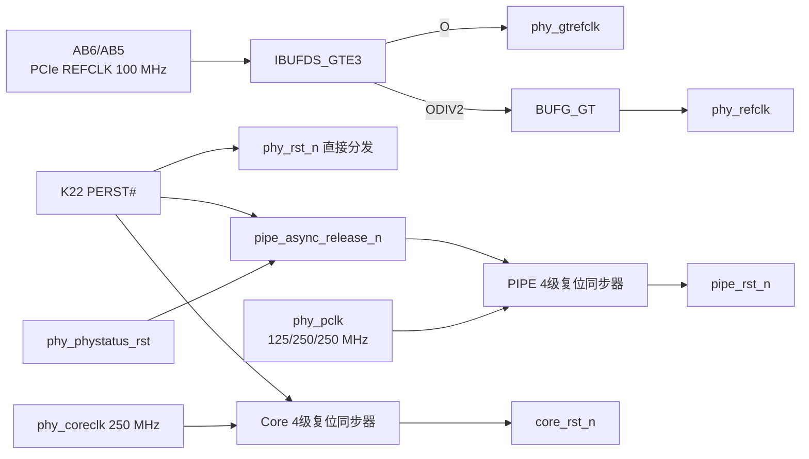

# K01 `kcu105_refclk_reset` 架构说明

状态：**PASS / K01-v1 架构与 RTL 已冻结**  
目标器件：`xcku040-ffva1156-2-e`

## 1. 模块职责

K01 负责：

- 使用一个 `IBUFDS_GTE3` 缓冲 KCU105 的 100 MHz PCIe 差分参考时钟；
- 将 `IBUFDS_GTE3.O` 作为 `phy_gtrefclk` 送入 standalone PHY；
- 将 `IBUFDS_GTE3.ODIV2` 经一个 `BUFG_GT` 缓冲后作为 `phy_refclk`；
- 将板级 PERST# 原样分发为 PHY 的低有效复位 `phy_rst_n`；
- 为 `phy_pclk` 域产生 `pipe_rst_n`，异步置位条件是 PERST# 或
  `phy_phystatus_rst`；
- 为固定 250 MHz `phy_coreclk` 域产生 `core_rst_n`，只受 PERST# 控制；
- 保证两个自研逻辑复位都异步置位、连续四个本域时钟同步释放。

K01 不负责：

- 不产生 `phy_pclk`、`phy_coreclk` 或 `phy_userclk`，这些时钟由 K02 PHY 输出；
- 不实现 PHY 初始化、Receiver Detect、Rate Change、Equalization 或 LTSSM；
- 不把 `phy_phystatus_rst` 扩散到 Core 域，速率切换不得清空配置空间；
- 不处理 Hot Reset；Hot Reset 是后续 LTSSM 到配置空间的受控事件；
- 不使用 KCU105 的 300 MHz `G10/F10` 时钟；
- 不滤除或延长 PERST#，`phy_rst_n` 必须直接反映板级输入。

## 2. 内部结构



Xilinx 本地 standalone PHY 示例
`/home/wx/Documents/KCU105/pcie_phy_0_ex/imports/xilinx_pcie_phy_top.v`
使用相同的 `IBUFDS_GTE3 + BUFG_GT` 参考时钟结构。本工程只参考时钟/复位连接，
不复制示例协议逻辑或生成物。

## 3. 复位方程与状态

K01 没有运行态状态机，只有两个长度为 `RESET_SYNC_STAGES` 的释放移位链：

```text
phy_rst_n             = pcie_perst_n
core_async_release_n  = pcie_perst_n
pipe_async_release_n  = pcie_perst_n && !phy_phystatus_rst
```

异步释放条件为 0 时，对应移位链不等待时钟立即清零。条件恢复为 1 后，每个本域
上升沿移入一个 1；默认第四个上升沿后输出复位释放。

`phy_phystatus_rst` 只重新置位 PIPE 域。它在 Gen1/Gen3 速率变化期间可以出现，
但不能改变 `phy_rst_n` 或 `core_rst_n`。PERST# 则同时置位 PHY、PIPE 和 Core
三个复位。

## 4. 缓冲、错误和可观测性

- 数据缓冲区：无；K01 不传输 PCIe 数据；
- 复位链深度：默认 4，允许 2～8；非法参数在 Elaborate 时报告错误；
- PIPE 时钟停止时：若复位已置位则保持置位，只有重新出现足够上升沿才能释放；
- 短 PERST#/`phy_phystatus_rst` 脉冲：只要进入 RTL，异步置位路径必须捕获；
- 可观测输出：`phy_gtrefclk`、`phy_refclk`、`phy_rst_n`、`pipe_rst_n`、
  `core_rst_n`，后续可直接加入 ILA。

## 5. CDC 原则

- 每个复位链的所有寄存器标记 `ASYNC_REG=TRUE`、`SHREG_EXTRACT=NO`；
- 不存在多位数据跨域；
- PERST# 和 `phy_phystatus_rst` 是异步复位源，XDC 中设置 False Path；
- `phy_pclk` 与 `phy_coreclk` 在本模块内无同步数据关系；后续 TLP 使用 M02
  Packet FIFO 跨域。
