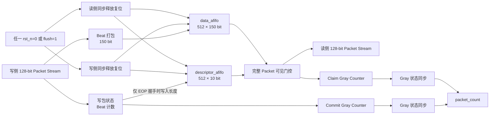

# M02 `pcie_async_pkt_fifo` 架构说明

状态：**PASS / M02-v1 已冻结**  
接口版本：M02-v1  
K00 复核器件：`xcku040-ffva1156-2-e`

## 1. 模块职责

M02 提供一个可复用的 128-bit TLP Packet Stream 异步 FIFO。K11 集成时分别
实例化两个：

- RX：`phy_pclk` 写入，`phy_coreclk` 读出；
- TX：`phy_coreclk` 写入，`phy_pclk` 读出。

模块负责：

- 在异步时钟之间无损传输 `data/keep/sop/eop/error`；
- 只有完整 Packet 的 EOP 已写入后，读侧才允许看到该 Packet；
- 支持包内 Backpressure、指针回绕、满/空和同时读写；
- 任一侧复位或公共 `flush` 都丢弃全部内容，包括尚未完成的 Packet；
- 输出写侧和读侧观察到的已提交 Packet 数量；
- 用 Sticky 状态记录源端协议/容量异常和读端整包一致性异常。

M02 不负责：

- 不解析或修改 TLP Header、Payload、字节序和 `error` 含义；
- 不实现 DLL Replay、Flow Control 或优先级仲裁；
- 不保证跨复位保存已经提交的 Packet；
- 不允许只复位并保留某一侧 FIFO 内容。

## 2. 复用的异步 FIFO

底层不重新实现 Gray 指针 FIFO，直接使用：

`/home/wx/Documents/AXI/prj_wb2axip_master/wb2axip-master/rtl/afifo.v`

- 来源：WB2AXIP 项目，作者 Dan Gisselquist；
- 许可证：Apache License 2.0，原文件许可证头保持不变；
- SHA-256：`e6c8d4731857caf504277dca72967c89dba6e3c83aee95953a0a279ff958cc4c`；
- 固定配置：正沿写、寄存读出、两级 Gray 指针同步；
- M02 只实例化该文件，不修改其源码。

构建脚本必须检查该 SHA-256。依赖缺失或内容改变时直接失败，避免在未评审的
情况下静默更换 CDC 核心。

## 3. 内部结构

## 4. 整包提交协议

### 写侧

每个 Beat 打包为 150 bit：

`{error[3:0], eop, sop, keep[15:0], data[127:0]}`

数据 Beat 在每次 `s_valid && s_ready` 时进入 `data_afifo`。写侧记录当前 Packet
的 Beat 数，但在中间 Beat 不写描述符。只有 EOP Beat 同时满足以下条件才握手：

- 数据 FIFO 非满；
- 描述符 FIFO 非满。

EOP 握手时将 Packet Beat 数写入 `descriptor_afifo`。因此描述符的存在就是
“整包已经提交”的凭证。

### 读侧

空闲时，即使数据 FIFO 已经出现前半个 Packet，只要描述符 FIFO 为空，
`m_valid` 必须保持为 0。描述符可用且首 Beat 握手时，读侧同时 Claim 一个描述符，
随后允许连续或带停顿地输出该 Packet，直至描述符长度对应的最后一个 Beat。

读侧比较描述符长度、SOP/EOP 和实际 Beat 数。出现提前 EOP、缺失 EOP、首 Beat
缺失 SOP，或者已 Claim Packet 时数据 FIFO 意外为空，置位 `m_underflow`。

## 5. 深度与流控

默认 `LGFIFO=9`：

- 数据 FIFO：512 Beat，即 8192 Byte Stream 容量；
- 描述符 FIFO：512 Packet；
- 单 Packet 合法长度：1～512 Beat；
- 计数器宽度：10 bit，可无歧义表示 0～512 个未 Claim Packet。

最大 PCIe TLP 小于该单包上限。若 Packet 超过 512 Beat，可能因当前 Packet 尚未
提交而无法由读侧释放空间，模块置位 `s_overflow`，必须通过 `flush` 恢复。

正常 Ready/Valid Backpressure 不是 Overflow。`s_overflow` 只记录以下异常：

- 源在 `s_valid=1 && s_ready=0` 期间撤销 Valid 或改变 Packet Beat；
- Packet 缺少首 Beat SOP、包内再次出现 SOP；
- Packet 长度超过 FIFO 能容纳的单包上限；
- 内部写使能与底层 Full 保护发生不可能组合。

## 6. Packet Count

- `s_packet_count`：写侧 Commit 计数减去同步回来的 Claim 计数；Claim 跨域有
  两拍延迟，因此该值可能短暂偏大。
- `m_packet_count`：同步过来的 Commit 计数减去本地 Claim 计数；Commit 跨域有
  两拍延迟，因此该值可能短暂偏小。
- 两个计数只用于状态/调试，流控必须使用 `s_ready/m_valid`。

## 7. 复位与 Flush

内部公共异步释放条件为：

`fifo_async_release_n = s_rst_n && m_rst_n && !flush`

该条件分别通过两级“异步置位、同步释放”复位链进入两个时钟域。任一 `rst_n`
拉低或 `flush` 拉高会异步复位两个 `afifo` 的指针、Packet 状态和错误状态。

这满足 `afifo.v` 对两侧共同置位复位的要求，并保证写到 SOP、中间 Beat 或 EOP
附近发生复位时，未完成 Packet 不可能在复位后输出。`flush` 必须至少覆盖一个
较慢时钟周期；释放后重新等待两个本地时钟。

## 8. CDC 与存储推断

- 数据和描述符 CDC 完全由未修改的 `afifo.v` 实现；
- Commit/Claim 只以 Gray 编码跨域，每位经过两级 `ASYNC_REG`；
- 不允许二进制多位计数器直接跨域；
- 默认深度和寄存读出配置应在 KU040 上推断 Block RAM；
- `s_clk` 与 `m_clk` 必须在 XDC 中声明为异步 Clock Group。
