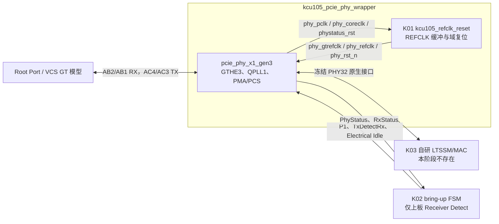

# K02 standalone `pcie_phy_x1_gen3` 架构说明

状态：**K02-v1.2 条件冻结；VCS 动态与上板延期**

目标器件：`xcku040-ffva1156-2-e`
IP：Vivado 2021.2 `xilinx.com:ip:pcie_phy:1.0`，Revision 19

## 1. 模块职责

K02 负责：

- 用确定性 Tcl 生成并版本管理 `pcie_phy_x1_gen3.xci`；
- 配置单个 `GTHE3_CHANNEL_X0Y7`、`GTHE3_COMMON_X0Y1` 和 QPLL1；
- 将 K01 的 100 MHz `phy_gtrefclk/phy_refclk/phy_rst_n` 接入 PHY；
- 用 `kcu105_pcie_phy_wrapper` 暴露冻结的 x1、32-bit PHY 原生接口；
- 将 PHY 输出的 `phy_pclk`、`phy_coreclk` 和 `phy_phystatus_rst` 回接 K01，产生
  `pipe_rst_n/core_rst_n`；
- 验证复位初始化、Receiver Detect 控制/完成握手、Gen1/2/3 Rate Change；
- 提供只用于 K02 上板验收的 Receiver Detect 自动控制顶层和 LED 状态；
- 完成 OOC 综合、完整布局布线、GT/管脚/时钟/DRC/时序检查。

K02 不负责：

- 不实现 LTSSM、TS1/TS2、Ordered Set、TLP/DLLP Framing 或 PCIe 枚举；
- 不在 PHY32 与后续 MAC 之间增加宽度转换或异步 FIFO；
- 不实现 Gen3 Equalization 状态机；K02 只证明 PHY 能执行后续 K12 发出的控制；
- 不用 Xilinx Endpoint、PCIe Hard Block 协议逻辑或 XDMA；
- 不把 Xilinx IP 生成源码、DCP、仿真导出目录纳入版本管理；只有 XCI 和生成 Tcl
  进入版本管理；
- 不把 VCS GT 模型的 Receiver Detect 结果当成真实板级终端电阻测量结果。

## 2. 数据与控制结构

正常工程使用 `kcu105_pcie_phy_wrapper`；`kcu105_pcie_phy_bringup_top` 只用于 K02
比特流。K03 集成时移除 bring-up FSM，由 LTSSM 驱动完全相同的冻结控制端口。

## 3. standalone PHY 固定配置

| 配置 | 冻结值 |
|---|---|
| VLNV | `xilinx.com:ip:pcie_phy:1.0` |
| `phy_lane` | `X1` |
| `phy_max_speed` | `8.0_GT/s` |
| `phy_refclk_freq` | `100_MHz` |
| `phy_userclk_freq` | `125_MHz` |
| `phy_coreclk_freq` | `250_MHz` |
| `phy_async_en` | GUI/XCI=`true`；生成模型必须为 `PHY_ASYNC_EN="FALSE"` |
| `lane0_gt_bank` | `GTH_Quad_225` |
| `lane0_gt_location` | `GTHE3_CHANNEL_X0Y7` |
| `refclk1_location` | `Bank_225_MGTREFCLK0` |
| `pll_type` | `QPLL1` |
| `pipeline_stages` | `0` |
| `ins_loss_profile` | `Add-in_Card` |
| `aspm` | `No_ASPM` |
| `Shared_Logic` | `1`，包含在 IP 内 |
| `gtwiz_in_core/gtcom_in_core` | `1/1` |
| `rx_detect` | `Default` |
| `tx_preset` | `4` |

`phy_async_en` 的 GUI 字段与生成模型参数命名语义相反；本地同版本 KCU105 示例也
呈现上述组合。生成检查必须同时检查两者，禁止只看 GUI 字段推断时钟结构。

### K02-v1.1 板级 LOC 修订

原始计划把 `lane0_gt_location` 写成 `GTHE3_CHANNEL_X0Y4`，但它与冻结的 KCU105
PCIe Lane 0 管脚不相容。K02 首次完整布局实际得到 X0Y7，随后按三项独立证据修订：

- UG917 表 1-9/1-12 把 `AB2/AB1` 和 `AC4/AC3` 标为 Quad 225 的
  `MGTHRXP/N3`、`MGTHTXP/N3`，即该 Quad 的 Channel 3；
- KU040 器件数据库把这组管脚映射为 `GTHE3_CHANNEL_X0Y7`；
- 本地 KCU105 XDMA 已布线报告同样显示 PCIe Lane 0 使用
  `GTHE3_CHANNEL_X0Y7` 和 `GTHE3_COMMON_X0Y1`。

`GTHE3_CHANNEL_X0Y4` 对应 Quad 225 的 Channel 0（参考管脚 AH2/AH1、AH6/AH5），
不是板上 PCIe Lane 0。管脚冻结值不变，修改 IP 的 Channel LOC 是唯一一致方案。

## 4. 时钟和复位

- K01 `IBUFDS_GTE3.O` → PHY `phy_gtrefclk`；
- K01 `IBUFDS_GTE3.ODIV2 → BUFG_GT` → PHY `phy_refclk`；
- PHY 输出 `phy_pclk`：Gen1/2/3 分别为 125/250/250 MHz；
- Gen1/2 每拍仅低 16 bit、两个 Symbol 有效；Gen3 使用完整 32 bit block 数据；
- PHY 输出 `phy_coreclk`：固定 250 MHz；
- PHY 输出 `phy_userclk`：固定 125 MHz，本阶段只观测；
- PHY 输出 `phy_mcapclk`：本阶段只观测；
- PERST# 直接驱动 PHY `phy_rst_n`；
- PIPE 复位异步条件为 `!pcie_perst_n || phy_phystatus_rst`；
- Core 复位只受 PERST# 控制，Rate Change 不能复位 Core；
- PHY 时钟未建立或 `phy_phystatus_rst=1` 时，PIPE 逻辑必须保持复位。

## 5. K02 bring-up FSM

FSM 在 `phy_pclk` 域运行，不参与后续协议：

1. `BUP_RESET`：保持 `PowerDown=P1`、`TxElecIdle=1`、`TxDetectRx=0`；
2. `BUP_SETTLE`：`pipe_rst_n` 释放后等待 16 拍；
3. `BUP_DETECT`：保持 P1/Electrical Idle，并置 `TxDetectRx=1`；
4. `BUP_WAIT_STATUS`：等待 `phy_phystatus=1`，锁存 `phy_rxstatus`；
5. `BUP_DONE`：撤销 `TxDetectRx`，保持结果和计数器供 LED/ILA 观察；
6. 超时：锁存 `detect_timeout=1`，不自动反复发起 Detect，防止掩盖故障。

VCS 模型的 GT 属性固定 `SIM_RECEIVER_DETECT_PASS="TRUE"`，所以它验证控制时序、
端口连接和完成状态编码；真实 Receiver Present 结论只以上板结果为准。

## 6. 缓冲、错误与可观测性

- 数据缓冲：无；IP 内部缓冲由 Xilinx 生成配置决定；
- 自研控制缓冲：无；bring-up FSM 只保存一次 `rxstatus`；
- 错误状态：初始化超时、Detect 超时、未知 `rxstatus`、Rate Change 超时；
- 静态可观测：IP 配置指纹、GT Channel/Common LOC、时钟资源、DRC、WNS；
- 动态可观测：`phy_phystatus_rst`、`pipe_rst_n`、三个 PHY 时钟、
  `phy_phystatus/rxstatus`、当前 Rate 和 Detect FSM 状态。
