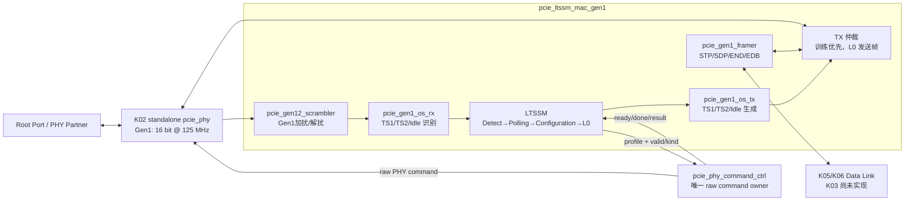

# K03 Gen1 x1 LTSSM/MAC 架构说明

状态：**K03-v1.2 PHY Command 边界已实现；VCS与KCU105 Gen1门禁PASS**

目标器件：`xcku040-ffva1156-2-e`
依赖接口：`K02-PHY32-v1.1`

## 1. 职责与边界

K03 负责：

- 固定 Gen1 x1 的 Detect、Polling、Configuration、Recovery、Hot Reset 和 L0；
- 在 PHY Gen1 低 16 bit 接口上生成、识别 TS1、TS2 和 Logical Idle；
- 选择 Receiver Detect、P0 PowerUp、G9等待及活动态语义 profile，并拥有协议超时和状态跳转；
- 捕获 Root Port 分配的 Link Number，固定 Lane Number 为 0；
- 识别/插入 Gen1 TLP/DLLP 的 `STP/SDP/END/EDB` framing Symbol；
- 输出 LTSSM 状态、训练/超时/成帧错误计数和 Gen1 x1 链路状态。

K03 不负责：

- 不计算 CRC16/LCRC，不实现 InitFC、ACK/NAK、Sequence 或 Replay；
- 不解析 TLP/DLLP 内容，不实现配置空间、BAR 或枚举；
- 不实现 Gen2/Gen3 升速或 Equalization，`phy_rate` 永久为 Gen1；
- 不直接驱动 raw PHY command，也不直接消费 Detect/Power 操作的
  `phy_phystatus/phy_rxstatus`；
- 不实现 x4、Lane Reversal、Lane Skew、ASPM、Compliance 或 Loopback；
- 不用硬件结果替代延期的 K02 VCS/实板门禁。

## 2. 内部结构



### 2.1 Ordered Set 接收器

- 每拍只采样 `phy_rxdata[15:0]` 和 `phy_rxdatak[1:0]`；线路上先到的 Symbol 位于
  `[7:0]`；
- Gen1/2 的有效拍只由 `phy_rxvalid` 指示；`phy_rxdata_valid` 属于 Gen3 block
  信息，K03 不得用它门控 TS1/TS2；
- PHY 可能把 TS 起始 COM 放在低或高 Symbol；`pcie_gen1_rx_symbol_aligner` 使用
  一字节寄存器把高 Symbol COM 与下一拍低 Symbol 跨拍重组，向 Ordered Set 和
  Packet Framer 统一提供低 Symbol 起始格式；
- 一个 TS 固定 16 Symbol、8 拍：COM、Link、Lane、N_FTS、Rate、Control、十个
  TS identifier；
- TS1 identifier 为 `D10.2=8'h4A`，TS2 为 `D5.2=8'h45`；PAD 为
  `K23.7=8'hF7`；
- 只有完整一致的 16 Symbol 才产生 `rx_ts1_valid/rx_ts2_valid` 单拍脉冲；
- L0 外连续收到 Logical Idle `K28.3=8'h7C` 时产生每拍两个 Idle 的计数事件。

### 2.2 Ordered Set 发送器

- 每个 TS 连续发送 8 拍，中间不可插入空拍；
- `phy_txdata[31:16]=0`，`phy_txdatak[1:0]` 只标记低 16 bit 两个 Symbol；
- `N_FTS=8'hFF`，Rate ID=`8'h02`，K03/K11-B1只宣告2.5 GT/s；K12加入
  Recovery.Speed/EQ后才开放Gen2/Gen3能力位；
- Training Control 默认为 0；Hot Reset 状态不伪造上游热复位 TS；
- Configuration.Idle/Recovery.Idle 每拍发送两个 `D0.0` 数据字符；`K28.3`
  属于 Electrical Idle Ordered Set，不得冒充 Logical Idle；
- L0 无待发 Packet 时也发送 Logical Idle。

### 2.3 Gen1/2扰码

- 16-bit LFSR初值为`16'hFFFF`，每拍按低Symbol、高Symbol顺序处理；
- COM把后继状态重置为`FFFF`，SKP不推进，其余有效Symbol推进8 bit；
- K字符不参与异或；训练期间Data也旁路异或，但LFSR仍按线路Symbol推进；
- TS解析使用原始PHY字符，Configuration.Idle、L0和Packet Framer使用解扰数据；
- TX在Configuration.Idle、L0和Recovery.Idle启用异或，其余训练状态仅旁路异或。

### 2.4 LTSSM

冻结状态顺序如下：

```text
Detect.Quiet → Detect.Active → PHY.PowerUp → Polling.Active → Polling.Configuration
 → Configuration.Linkwidth.Start → Configuration.Linkwidth.Accept
 → Configuration.Lanenum.Wait → Configuration.Lanenum.Accept
 → Configuration.Complete → Configuration.Idle → L0

L0 → Recovery.RcvrLock → Recovery.RcvrCfg → Recovery.Idle → L0
任意活动状态 --PERST#/LinkDisable/超时--> Detect.Quiet
L0 --HotResetReq--> HotReset → Detect.Quiet
```

- Detect.Quiet 选择P1/Electrical Idle profile；Detect.Active发出Receiver Detect
  语义事务。controller在当前拍把`phy_phystatus/phy_rxstatus`转换为`done/result`，
  仅Receiver Present结果使LTSSM继续；
- Detect 成功后进入 PHY.PowerUp，请求 P0 但继续保持 TX Electrical Idle；等待
  Power 操作的第二个、独立 `phy_phystatus` 后才进入 Polling.Active 发 TS1；
- Polling.Active 连续接收 8 个 PAD/PAD TS1 后进入 Polling.Configuration；
- Polling.Configuration 连续接收 8 个 PAD/PAD TS2 后进入 Configuration；
- Linkwidth.Start 捕获非 PAD Link Number；本 Endpoint 只接受 Lane 0；
- Linkwidth.Accept/Lanenum.Accept 分别要求接收 2 个匹配 TS1，并且本端在对应
  子状态至少发送 16 个 TS1；Complete 要求接收 8 个匹配 TS2且本端至少发送
  16 个 TS2；Idle 要求 8 拍双 Logical Idle；
- Accept 子状态的接收条件达到门槛后锁存；如果对端更早进入下一子状态并发送
  Link/Lane TS1或TS2，不得清除已满足条件，本端继续发送到16个后再前进；
- Recovery 对匹配 Link/Lane 的 TS1、TS2 和 Idle 分别执行 8/8/8 次确认；
- 每次状态变化清零连续计数和超时计数；错误 TS 打断连续计数并累加训练错误；
- 所有硬件默认超时以 125 MHz 周期参数给出，仿真可参数覆盖缩短，但协议状态顺序
  不得因仿真参数改变。

### 2.5 TLP/DLLP 成帧

TX 使用一个完整 Packet 缓冲，默认 160 Byte，可容纳第一阶段最大 128 Byte Payload、
4DW Header、Sequence 和 LCRC。只有收到 EOP 后才开始上线，因此 DLL 输入可有
backpressure 或空拍，物理线上 Packet 内部不会产生空洞。

- TLP 前插 `STP=K27.7/8'hFB`；DLLP 前插 `SDP=K28.2/8'h5C`；
- 正常结束插 `END=K29.7/8'hFD`，错误结束插 `EDB=K30.7/8'hFE`；
- RX 去除 delimiter 后输出 16-bit beat；起始拍可为 `keep=01`，当 END 位于低
  Symbol 时允许一个 `keep=00,eop=1` 的控制结束拍；
- PHY 没有 RX 反压，故 RX MAC→DLL 通道为 valid-only。后续 DLL 必须逐拍接收；
  K03 发现嵌套 Start、Packet 内非法 K-code 或无 Start 的 End 时丢弃当前帧并计数；
- 离开 L0 时清空未发送 TX Packet 和未结束 RX Frame。

## 3. 缓冲、时钟与复位

- 全部 K03 RTL 位于 `phy_pclk` 域，Gen1 为 125 MHz；无 CDC；
- `pipe_rst_n` 异步置位、同步释放；K03 内部只同步使用其释放边沿；
- TX Packet Buffer：160 Byte，单 Packet，收包与发包互斥；满时撤销
  `tx_pkt_ready`；
- RX 不缓存完整 Packet，也不能反压；异常时丢弃到下一个 Start/Idle；
- PERST# 通过 K01 形成 `pipe_rst_n=0`，立即回到 Detect.Quiet 并清空所有上下文；
- Hot Reset 只复位 Link/MAC 状态，后续通过单拍 `hot_reset_seen` 通知配置域，不直接
  复位 `core_rst_n`。

## 4. 错误与可观测性

- `training_error_count[31:0]`：饱和记录 malformed TS、字段不匹配和非法跳转；
- `timeout_count[31:0]`：饱和记录 Detect/Polling/Configuration/Recovery 超时；
- `frame_error_count[31:0]`：饱和记录 TX stream 协议错、过长 Packet、嵌套 marker、
  非法 K-code 和 EDB；
- `ltssm_state[5:0]`、`rx_ts_count[4:0]`、`link_number[7:0]` 供 ILA；
- `link_up` 仅表示 LTSSM=L0；DLL Active 将在 K05 后加入系统级 `link_up` 条件。

## 5. K03 验收边界

K03-v1.2以行为PHY Partner、controller逐拍等价测试、ownership负向fixture、KU040
OOC/完整实现、真实PHY VCS及KCU105 Gen1 Endpoint闭环验收。Phase B/C固定Gen1，
`phy_rate`及TXEQ/RXEQ均为零；Golden rate-change、128b/130b和EQ不属于本版本。
