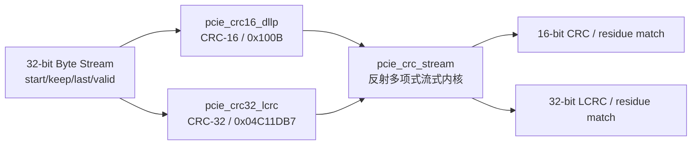

# K04 PCIe DLLP CRC16 与 TLP LCRC32 架构说明

状态：**K04-v1 已实现并冻结**

目标器件：`xcku040-ffva1156-2-e`

接口版本：`K04-CRC32S-v1`

## 1. 职责与边界

K04 负责：

- 按 PCI Express 规则逐 Byte 计算 DLLP 16-bit CRC；
- 按 PCI Express 规则逐 Byte 计算 TLP 32-bit LCRC；
- 支持 32-bit 流式输入、末拍 Byte Enable、任意合法反压间隔和连续 Packet；
- 同时提供 CRC 生成结果和“包含接收 CRC 的完整流”余数检查；
- 检测输入 Packet 握手协议错误，并立即丢弃当前 CRC 上下文。

K04 不负责：

- 不生成 DLLP 字段、TLP Sequence Number、TLP Header 或 Payload；
- 不插入、删除、缓存或重排 CRC Byte；
- 不实现 ACK/NAK、Flow Control、Replay 或坏包处置策略；
- 不判断 DLLP 固定 4 Byte 或 TLP 的协议长度，这些由 K05/K06 负责；
- 不处理 ECRC；本工程第一阶段不支持 ECRC；
- 不实现 TLP Nullify 决策。K06 若发送 Nullified TLP，应对正常 LCRC 字段逐 bit
  取反并配合 EDB。

## 2. 模块划分

- `pcie_crc_stream` 是参数化公共引擎，按 `keep[0]` 到 `keep[3]` 的顺序处理
  `data[7:0]` 到 `data[31:24]`；
- `pcie_crc16_dllp` 固定 16-bit 参数并收窄输出；
- `pcie_crc32_lcrc` 固定 32-bit 参数；
- 两个包装模块是后续 DLL 唯一允许实例化的接口，K05/K06 不直接覆盖引擎参数。

## 3. CRC 数学与线序冻结

### 3.1 DLLP CRC16

- 生成多项式：`x^16 + x^12 + x^3 + x + 1`，系数表示 `16'h100B`；
- 初值：`16'hFFFF`；
- 每个 Byte 从 bit 0 到 bit 7 进入 CRC；Byte 按线路先后顺序处理；
- RTL 使用等价反射多项式 `16'hD008` 右移实现；
- 生成字段为最终状态逐 bit 取反；`crc_result[7:0]` 是先上线的 CRC Byte；
- 对“4 Byte DLLP + 2 Byte 正确 CRC”继续计算后，反射状态固定为 `16'h556F`。

DLLP 参考模型固定使用当前环境 `cocotbext-pcie 0.2.16` 的
`cocotbext.pcie.core.dllp.crc16` 做第二来源交叉验证。

### 3.2 TLP LCRC32

- 生成多项式：`x^32 + x^26 + x^23 + x^22 + x^16 + x^12 + x^11 +
  x^10 + x^8 + x^7 + x^5 + x^4 + x^2 + x + 1`，系数表示
  `32'h04C11DB7`；
- 初值：`32'hFFFFFFFF`；
- 从 TLP Sequence Number 的第一个线路 Byte 开始，逐 Byte、每 Byte bit 0→7；
- RTL 使用等价反射多项式 `32'hEDB88320` 右移实现；
- 生成字段为最终状态逐 bit 取反；`crc_result[7:0]` 是先上线的 LCRC Byte；
- 对“Sequence Number + TLP + 4 Byte 正确 LCRC”继续计算后，反射状态固定为
  `32'hDEBB20E3`；按整字 bit-reverse 表示即 `32'hC704DD7B`，与现有 PLDA
  可综合交付网表中的 LCRC residue 常量交叉一致。

## 4. 数据通路与时序

每个实例只保存一个 CRC 状态寄存器和一个 `busy` 标志，不缓存 Packet：

1. 接受带 `start=1` 的首拍时以固定初值计算；
2. 普通拍从前一拍 CRC 状态继续；
3. 同一拍内只处理 `keep=1` 的 Byte，顺序固定为 lane 0→3；
4. 接受 `last=1` 的末拍后，下一周期给出单拍 `crc_valid`；
5. `crc_result` 是不包含 CRC 字段时应追加的正常 CRC；
6. `crc_match` 只在输入流已经包含接收 CRC 字段时有意义，表示最终原始状态等于
   固定 residue；
7. 末拍后一周期可以同时接受下一个 Packet 首拍，吞吐无额外空拍要求。

组合路径最多为一拍四 Byte、每 Byte 八次 LFSR 更新；目标频率为 250 MHz。

## 5. Packet 规则与错误处理

- 首拍必须 `start=1`，中间/末拍必须 `start=0`；单拍 Packet 允许
  `start=last=1`；
- `keep` 至少一位为 1；非末拍必须为 `4'b1111`；
- 末拍支持全部 15 种非零 `keep`，稀疏 mask 按有效 lane 升序拼接 Byte；
- `valid=0` 时所有输入控制均不采样，可插入任意空拍；
- Packet 未结束又出现 `start`、空闲时出现无 `start` 数据、`keep=0` 或非末拍
  `keep!=1111` 均产生单拍 `protocol_error`；
- 协议错误不会产生 `crc_valid`，CRC 状态恢复初值，下一拍可以重新开始；
- 复位丢弃进行中的 Packet，不产生结果或错误脉冲。

## 6. 时钟、复位和资源

- 全部逻辑属于单个 `clk` 域；K05/K06 集成时连接 `phy_pclk`；
- `rst_n` 低有效，异步置位、同步释放由上游 K01 保证；
- 模块内部不产生 CDC，不使用 FIFO、BRAM、DSP 或 Xilinx 专用原语；
- CRC 结果、match 和 error 都是寄存输出，无组合 `valid-ready-valid` 环路。

## 7. K04 验收边界

K04 只以 bit-accurate 参考模型、Checker 自检、Directed/随机回归、Lint 和 KU040
250 MHz OOC 综合签核。VCS 编译因已记录的许可证不可用可延期，但 Verilator 与
Vivado 必须通过。冻结 K04 报告后停止，不自动开始 K05。
