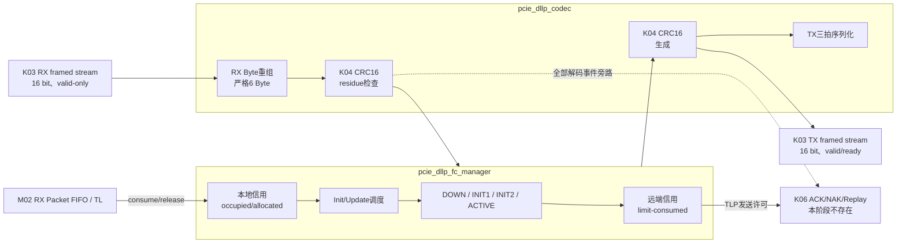

# K05 DLLP 与 VC0 Flow Control 架构说明

状态：**K05-v1 已实现并冻结**

目标器件：`xcku040-ffva1156-2-e`

依赖接口：`K03-MAC16-v1`、`K04-CRC32S-v1`

接口版本：`K05-FC16-v1`

## 1. 职责与非职责

K05 负责：

- 在 K03 16-bit framed stream 上重组和发送固定 6 Byte DLLP；
- 复用 K04 `pcie_crc16_dllp` 生成、检查 DLLP CRC16；
- 编解码 VC0 的 InitFC1、InitFC2 和 UpdateFC P/NP/Cpl；
- 分别维护远端 PH/PD、NPH/NPD、CplH/CplD 信用并给出 TLP 发送许可；
- 根据本地 RX Buffer 的 consume/release 事件维护累计信用并发送 UpdateFC；
- 检测 DLLP 长度、K03 framing、CRC、VC、Scale 和信用上下溢错误。

K05 不负责：

- 不实现 ACK/NAK、12-bit Sequence、Replay Timer 或 Replay Buffer；
- 不解析 TLP Header，不自行判断 TLP 属于 P、NP 还是 Cpl；
- 不接收或释放实际 TLP Buffer，只消费 K06/TL 提供的结构化信用事件；
- 不支持 VC1～VC7、Scaled Flow Control、Multi-Function 或无限本地信用；
- 不修改 K03 LTSSM；物理链路离开 L0 时清除 FC 会话，但错误统计保留到 PERST#；
- 不抢先实现 K06 DLLP TX 仲裁。K06 可直接复用冻结的 Codec 原始 DLLP接口。

## 2. 模块结构



对外顶层为 `pcie_dllp_fc`，内部实例化 Codec 和 FC Manager。Codec 与 Manager
也保持普通 SystemVerilog 端口，K06 加入 ACK/NAK 仲裁时不修改其已冻结语义。

## 3. DLLP Codec

### 3.1 RX

K03 可能在 SDP 同拍给出 1 Byte 首数据，也可能在下一拍开始，因此 Codec 不假定
固定拍型，只按 `keep=01/11` 的有效 Byte 顺序累计：

1. `sop=1` 建立 DLLP 上下文；
2. 接收 4 Byte DLLP 内容和 2 Byte CRC；
3. `eop=1` 时总长度必须恰好为 6 Byte；
4. 前 4 Byte 以一拍 `keep=1111`、后 2 Byte 以一拍 `keep=0011` 送入 K04 CRC16；
5. residue 为 `16'h556F` 时 `crc_good=1`；
6. CRC 错误包仍产生可观测事件，但 FC Manager 必须忽略。

`keep=10`、缺失/嵌套 SOP、超过/少于 6 Byte、K03 `rx_pkt_error!=0` 和内部队列
冲突均标记错误。TLP 帧 `is_dllp=0` 不由 Codec 消费，K06 后续可并行接收。

### 3.2 TX

TX 输入是 4 Byte 原始 DLLP，线路首 Byte 位于 `data[7:0]`。Codec 先用 K04 生成
CRC16，再向 K03 输出三拍：

```text
拍0：DLLP Byte0/1，sop=1，keep=11
拍1：DLLP Byte2/3，keep=11
拍2：CRC Byte0/1，eop=1，keep=11
```

K03 负责加入 SDP/END。Codec 在 K03 `ready=0` 时保持全部输出，不丢失或重算。

## 4. FC 初始化状态机

状态编码冻结为：`DOWN=0`、`INIT1=1`、`INIT2=2`、`ACTIVE=3`。

```text
link_up=0 → DOWN
DOWN + link_up → INIT1
INIT1 + 收齐远端P/NP/Cpl初始值 → INIT2
INIT2 + 收到任一合法InitFC2或UpdateFC → ACTIVE
任意状态 + link_up=0 → DOWN
```

- INIT1 按 P→NP→Cpl 循环发送 InitFC1，丢失或重复不会停止重发；
- INIT1 接收 InitFC1 或提前到达的 InitFC2，按类型捕获远端初始信用；
- INIT2 按 P→NP→Cpl 循环发送 InitFC2；
- ACTIVE 后才允许 TLP 消耗远端信用，并发送累计 UpdateFC；
- 无初始化超时；物理链路保持 L0 而对端不响应时，DLL 保持非 Active 并继续重发；
- 坏 CRC、非 VC0 或非零 Scale 不推进状态。

## 5. 信用模型

### 5.1 单位与计数宽度

- Header Credit：每个 TLP 消耗 1，字段按 8 bit 模 256；
- Data Credit：每 16 Byte Payload 消耗 1，由 TLP 层向上取整后输入，字段按
  12 bit 模 4096；无 Payload 时输入 0；
- 远端 InitFC 字段为 0 时，按 PCIe 语义视为该类无限信用；
- 本地初始信用全部为有限非零值，不使用 0 编码。

远端可用量按 `(credit_limit-credit_consumed) mod field_width` 计算。Manager 只在
`dll_active=1`、Header 可用且 Data 可用量不少于请求时给出发送许可。

### 5.2 本地 RX Buffer 划分

默认参数与 M02 默认 512×16 Byte（8192 Byte）FIFO 对应，按最坏 16 Byte Header
保守预留：

| 类别 | Header Credit | Data Credit | 最坏占用 |
|---|---:|---:|---:|
| Posted | 32 | 128 | 2560 Byte |
| Non-Posted | 32 | 16 | 768 Byte |
| Completion | 8 | 32 | 640 Byte |
| 合计 | 72 | 176 | 3968 Byte |

剩余 4224 Byte 作为 Packet 边界、跨域可见延迟和实现裕量。若 M02 深度或分区改变，
必须同时修改参数、重新证明最坏占用并重跑 K05/K11。

本地 `consume` 增加占用；`release` 减少占用并递增累计 allocated counter。UpdateFC
发送累计 allocated 值而不是瞬时 available 值。占用越界、释放未占用信用、非法
类型或一次 Data Credit 超过本地分区均只计错，不更新错误事件对应的计数器。

## 6. UpdateFC 调度

- 每个合法 release 立即置对应 P/NP/Cpl dirty；
- ACTIVE 入口先把三类全部置 dirty；
- 固定周期 `UPDATE_INTERVAL_CYCLES=256` 在 125 MHz 下约 2.048 us，把三类全部
  置 dirty，防止 DLLP 丢失后永久失去信用；
- dirty 项按 P→NP→Cpl 轮询，每次 Codec 接受一项后清除；
- 同拍新 release 与旧 UpdateFC 发送冲突时保留 dirty，保证新累计值后续再发送。

## 7. 错误、复位和资源

- `pipe_rst_n=0` 异步清空 Codec/FC；释放由 K01 保证同步；
- `link_up=0` 同步清除当前 FC 会话、远端信用、占用和待发 DLLP，统计计数保留；
- DLLP malformed、bad CRC、FC 协议错误和 TX/RX FC 数量分别用 32-bit 饱和计数；
- Codec 只有两个 K04 CRC16 实例、6 Byte 寄存器和小状态机；Manager 只用寄存器，
  不使用 BRAM、DSP、FIFO 或 PCIe Hard Block；
- 全部逻辑属于 `phy_pclk` 域，无 CDC。

## 8. K05 验收边界

K05 以错误 Stub、cocotbext DLLP 交叉模型、独立 DLL Partner、百万信用事件、Lint
和 KU040 250 MHz OOC 为当前门禁。VCS 编译按已批准的许可证延期记录处理；K05
不需要板卡即可冻结。完成报告后停止，不自动加入 K06。
