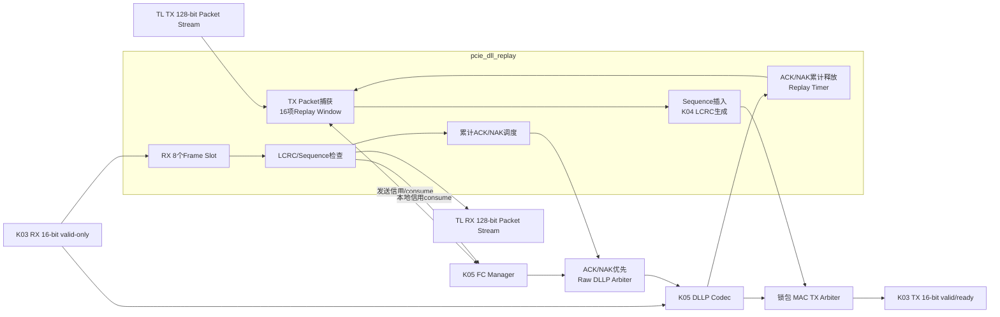

# K06 Data Link ACK/NAK 与 Replay 架构说明

状态：**K06-v1 已实现并冻结**

目标器件：`xcku040-ffva1156-2-e`

依赖接口：`K03-MAC16-v1`、`K04-CRC32S-v1`、`K05-FC16-v1`、`M02-v1`

接口版本：`K06-REPLAY128-v1`

## 1. 职责与非职责

K06 负责：

- TX TLP 分配 12-bit Sequence Number，并把两个 Sequence Byte 放在 TLP 前；
- 复用 K04 `pcie_crc32_lcrc` 计算、追加和检查 LCRC；
- 保存所有已发送但尚未累计 ACK 的 TLP；
- 解析 ACK/NAK DLLP，执行累计释放、NAK Replay 和 Replay Timer Replay；
- RX 只向 TL 提交 LCRC 正确且 Sequence 等于期望值的唯一 TLP；
- 对重复 TLP 只返回累计 ACK，不重复提交或重复消耗本地信用；
- 对坏 LCRC、EDB、malformed 或未来 Sequence 返回 NAK；
- 仲裁 ACK/NAK 与 K05 FC DLLP，并在 DLLP/TLP 之间锁包仲裁到 K03；
- 输出重放、LCRC、Sequence、非法 ACK/NAK 和 Buffer 错误统计。

K06 不负责：

- 不解析完整 TLP Header，不生成 Completion、UR 或 CA；
- 只为信用管理最小识别 P/NP/Cpl 和 Payload Length，完整解码属于 K07；
- 不实现多个 VC、Selective ACK、ECRC、Data Link Feature Exchange 或 Nullified TLP；
- 不实现配置空间、BAR、DMA、MSI/MSI-X；
- 不改变 K03、K04、K05 和 M02 已冻结接口；
- 不自动修改 LTSSM。连续 Replay 超限只输出 `recovery_req`，由 K11 连接 K03。

## 2. 模块结构



生产顶层 `pcie_dll` 集成 K05 Codec/FC Manager、K06 Replay Core 和两个仲裁器。
`pcie_dll_replay` 保持可独立验证，避免用集成环境掩盖 Sequence/Replay 错误。

## 3. TX 数据路径与 Replay Window

### 3.1 Packet 捕获

- TL 输入为冻结的 128-bit Packet Stream，首 Byte 在 `data[7:0]`；
- 最大原始 TLP 为 144 Byte，即 4DW Header 加 128 Byte Payload；最小为 12 Byte；
- 原始 TLP 必须按 DWORD 对齐，末拍 `keep` 必须为连续低位掩码；
- SOP 时采样 `tx_tlp_type` 和 `tx_tlp_data_credits`；
- 一个 Packet 完整收到 EOP 后才提交到 Replay Window；错误或中途复位不提交；
- 默认 `REPLAY_DEPTH=16`，必须为 2 的幂且不大于 2048，保证 12-bit 模比较无歧义。

每项保存原始 TLP、Byte Length、类型、Data Credit、Sequence、已发送标志。三个扩展
环形计数器分别表示已写入、首次发送和累计释放位置，因此可在同拍 Enqueue、发送和
ACK，不依赖有优先级的数据包计数更新。

### 3.2 首次发送

只有 `dll_active=1`、存在未发送项且 K05 对队首类型/数据量给出信用许可时才开始：

1. 分配 `next_tx_seq`，初值 `12'h000`；
2. 首拍向 K03 输出 `{seq[7:0], 4'h0, seq[11:8]}`，线路顺序为高4位后低8位；
3. 依次输出原始 TLP；
4. Sequence 和原始 TLP 同步送入 K04 LCRC32；
5. 追加 `lcrc[7:0]` 至 `lcrc[31:24]` 四个 Byte；
6. Sequence 首拍握手时只消耗一次 K05 信用并把该项纳入 Outstanding Window。

K03 会在收到完整 EOP 后才上线，因此计算 LCRC 期间允许输入空拍。首次发送和 Replay
生成完全相同的 Sequence/TLP/LCRC Byte 串；Replay 不再次消耗 Flow Control 信用。

### 3.3 ACK/NAK 与累计释放

`last_acked_seq` 初值为 `12'hfff`。收到 ACK/NAK 序列 `S` 时，累计前进量为：

```text
advance = (S - last_acked_seq) mod 4096
```

- `advance=0` 是重复 ACK/NAK，不释放新项；
- `0 < advance <= outstanding_count` 时释放最老的 `advance` 项；
- `advance > outstanding_count` 是未来或陈旧序列，忽略并计错；
- NAK 在完成上述累计释放后，从新的最老 Outstanding 项重放到首次未发送位置；
- ACK/NAK CRC 或 framing 错误不改变 Replay Window。

Sequence 完整按 4096 回绕。Window 深度小于 2048，所有前后关系使用半范围规则。

### 3.4 Replay Timer

- 默认 `REPLAY_TIMEOUT_CYCLES=2048`，在 Gen1 125 MHz 下为 16.384 us；
- 存在 Outstanding TLP 时计时，有效累计 ACK 前进或启动 Replay 时重新计时；
- 超时重放当前全部 Outstanding TLP，停止首次发送直到该轮 Replay 完成；
- 连续 `REPLAY_RETRY_LIMIT=3` 次超时没有 ACK 前进时，置位 `replay_fatal` 并产生
  单拍 `recovery_req`；离开 DLL Active 后清除会话和 fatal；
- NAK Replay 计入 Replay 次数，但不增加连续 Timer Retry 次数。

## 4. RX 数据路径

### 4.1 完整帧槽

K03 RX 不可反压。K06 默认提供 `RX_FRAME_SLOTS=8`，每槽 150 Byte，可同时容纳：

```text
2 Byte Sequence + 144 Byte TLP + 4 Byte LCRC
```

物理 Frame 槽总计 1200 Byte。为使 CRC 检查和 128-bit TL 输出都使用同步存储，另有
8×144 Byte 的 Payload 暂存，共计 2352 Byte；仍小于 K05/M02 规划中未广告的
4224 Byte实现裕量，不占用已经广告给对端的 P/NP/Cpl 信用。若槽数、M02深度或
K05 本地信用改变，必须重新证明总容量。

完整 EOP 后，由单个 K04 LCRC32 Engine 按接收顺序检查；CRC处理速率为每拍4 Byte，
高于 Gen1 x1 每拍2 Byte 的线路输入。Frame Slot 写入和队首校验/输出允许并行。

### 4.2 Sequence 判定

`next_rx_seq` 初值为 `12'h000`：

- `seq == next_rx_seq`：唯一新包；递增期望值、消耗一次本地信用并提交 TL；
- `(next_rx_seq-seq) mod 4096 < 2048`：重复包；丢弃并立即 ACK `next_rx_seq-1`；
- 其他值：未来/乱序包；丢弃并 NAK `next_rx_seq-1`；
- LCRC、长度、framing、EDB 错误：不观察其中 Sequence，丢弃并 NAK；
- TL 只看到去除 2 Byte Sequence 和 4 Byte LCRC 的原始 TLP，且错误包永不露出。

### 4.3 ACK/NAK 发送

- ACK/NAK 内容与 `cocotbext-pcie Dllp.pack()` 逐 Byte一致；
- 首个唯一新包启动 ACK Latency Timer，默认 `ACK_LATENCY_CYCLES=128`；
- 后续连续包合并成最新累计 ACK，不重新启动已经运行的 Timer；
- Duplicate 触发立即 ACK，坏包/未来包触发立即 NAK；NAK 优先且不会被 ACK 覆盖；
- ACK/NAK Raw DLLP 对 K05 FC Raw DLLP 具有优先级，但只在 Packet 边界仲裁。

## 5. 最小信用分类

K06 只读取首 DWORD 的 `Fmt/Type/Length`：Memory Write 归 P；Memory Read 与
Configuration Request 归 NP；Completion 归 Cpl；其他类型保守归 NP，交由 K07
决定后续 UR/错误。Data Credit 为有 Payload TLP 的 `ceil(length_dw*4/16)`，无
Payload 为 0。该分类只驱动 K05 Buffer consume，不替代 K07 完整 TLP Codec。

## 6. 复位、错误与资源

- `pipe_rst_n=0` 异步清空全部状态；K01 保证同步释放；
- `dll_active=0` 同步丢弃 TX/RX 未完成帧、Replay Window 和 ACK/NAK 会话；
- 统计仅在 `pipe_rst_n=0` 清零，使用 32-bit 饱和计数；
- Replay Window 和 RX Frame Slots 允许推断 BRAM/LUTRAM；不使用 DSP 或 PCIe Hard Block；
- KU040 当前 OOC 将三个浅存储体推断为 LUTRAM；Payload RAM 写请求、FC许可和
  ACK/NAK事件均有一级寄存，以满足250 MHz并切断跨模块长组合路径；
- K04 CRC接口保持不变，RX使用已寄存的`crc_result`在下一拍比较LCRC residue；
- 全部 K06 RTL 位于 `phy_pclk` 域，无新增 CDC；
- Packet Stream 反压时全部信号稳定，不形成组合 valid-ready-valid 环路。

## 7. K06 验收边界

K06 以错误 Stub、cocotbext ACK/NAK交叉模型、Bit-accurate LCRC、完整 Sequence回绕、
NAK/ACK丢失/重复/超时恢复、随机反压、独立百万事件模型、Lint 和 KU040 250 MHz
OOC 为当前门禁。VCS仍按许可证延期记录处理；K06不需要板卡即可冻结。完成后停止，
不自动开始 K07。
