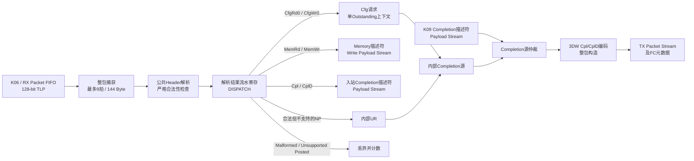

# K07 TLP Codec 架构冻结

状态：**K07-TLP-CODEC-v1 架构冻结**

## 1. 本阶段职责

`pcie_tlp_codec`位于`phy_coreclk`（250 MHz）域，职责固定为：

1. 接收K06已经去除Sequence Number和LCRC的128-bit TLP Packet Stream；
2. 必须等到完整EOP后，才解析并分派Cfg、Memory和Completion TLP；
3. 严格检查Fmt/Type、Header、Length、Payload长度、BE、4 KiB边界和本版本保留字段；
4. 输出结构化Cfg请求、Memory请求和入站Completion；
5. 将Cfg响应、内部UR/CA以及K09提供的Completion描述符编码为完整TLP；
6. 输出K06需要的TX信用元数据，以及RX Packet对应的信用释放事件；
7. 对Malformed、Unsupported、Poisoned和Unexpected Completion分别计数。

K07明确不实现配置寄存器、BDF比较、BAR命中、Memory Space Enable、AXI4-Lite、
MPS/RCB/4 KiB Completion拆分、MSI、DMA或主动Memory Request。这些分别属于K08、
K09及已排除范围。

## 2. 数据路径



## 3. 内部结构与状态机

### 3.1 RX整包捕获

- 一个144 Byte整包槽，等价于9个128-bit拍；第一版刻意保持单事务顺序；
- `IDLE/CAPTURE`只负责保存握手数据、累计Byte数和协议错误；
- 非末拍`keep`必须为`16'hffff`，末拍必须为从bit0开始连续的非零掩码；
- 缺少SOP、包内重复SOP、超过9拍、上游`error!=0`均使整包Malformed；
- 只有EOP握手后进入`PARSE`，在此之前所有Cfg/Memory/Completion输出`valid=0`；
- Packet RAM不做全阵列复位，只复位状态、长度和有效标志，避免形成大复位网络。

### 3.2 RX解析和分派状态

固定状态顺序为：

```text
IDLE -> CAPTURE -> PARSE -> DISPATCH
                                |-> CFG_REQ -> CFG_RSP -> IDLE
                                |-> MEM_DESC -> MEM_PAYLOAD -> IDLE
                                |-> RX_CPL_DESC -> RX_CPL_PAYLOAD -> IDLE
                                |-> INTERNAL_CPL(UR/CA) -> IDLE
                                `-> DROP -> IDLE
```

- `PARSE`只锁存深组合合法性结果并完成Payload对齐，`DISPATCH`下一拍更新诊断、
  计数和目标状态；该一级流水只增加1拍延迟，不改变外部握手或Packet内容；
- Memory Read在描述符握手后直接完成；Memory Write必须先握手描述符，再输出Payload；
- Cpl无Payload时在描述符握手后完成；CplD先描述符、后Payload；
- Cfg深度固定为1，因为冻结的`cfg_rsp`没有事务ID；等待响应期间保持Requester ID、
  Tag、TC、Attr和读写方向；
- 下游反压时描述符和Payload保持稳定；单槽结构不承诺连续每拍接收Packet。

### 3.3 Completion编码

- 内部Cfg/UR/CA源优先于外部K09 Completion源；已经开始的Packet不允许被抢占；
- Completion固定为3DW Header，CplD单包最大32 DW（128 Byte）；
- 编码器先构造完整Packet再对外发送，避免12 Byte Header后产生非法中间`keep`；
- TX共9个128-bit字，CplD Payload按线路Byte顺序平移12 Byte：首个Payload DWORD
  位于首拍`data[127:96]`；
- 外部Payload必须与描述符`length_dw`精确一致；错误输入被丢弃并增加
  `tx_protocol_error_count`；
- 输出`tx_tlp_type=2'b10`，`tx_tlp_data_credits=ceil(payload_bytes/16)`。

### 3.4 RX信用释放与K11适配要求

K06在接收唯一、LCRC正确的TLP时已经消耗FC信用。K07在完整输入Packet的EOP提交后
产生且仅产生一个`rx_tlp_release`事件，类型和Data Credit逐位复刻K06分类：

```text
Type[4:0]==0x0a                -> Cpl
否则Type==0且Fmt表示有Payload -> P
否则                            -> NP
Data Credit = 有Payload ? ceil(LengthDW/4) : 0
```

释放表示上游M02 Packet槽已经被K07取走，不等待Cfg/BAR事务完成。事件使用
`valid/ready`保持，不能用单周期跨域脉冲。

M02-v1只跨`data/keep/sop/eop/error`，没有K06所需元数据。因此K11必须新增独立CDC
适配器：TX每个已提交Packet附带一项`type/data_credits`异步元数据；RX release通过
core到pipe的事件FIFO传输。Packet与元数据必须原子commit/claim、同时flush，并断言
计数相等。K07不修改M02-v1，也不把元数据塞入`error`字段。

## 4. 支持矩阵

| TLP | Fmt/Type首Byte | Header | Length | K07行为 |
|---|---:|---:|---:|---|
| MemRd32 | `00` | 3DW | 1～1024 DW | 输出Memory Read描述符 |
| MemRd64 | `20` | 4DW | 1～1024 DW | 输出Memory Read描述符 |
| MemWr32 | `40` | 3DW | 1～32 DW | 描述符后输出Payload |
| MemWr64 | `60` | 4DW | 1～32 DW | 描述符后输出Payload |
| CfgRd0 | `04` | 3DW | 固定1 DW | 输出Cfg Read并编码响应 |
| CfgWr0 | `44` | 3DW | 固定1 DW | 输出Cfg Write并编码响应 |
| Cpl | `0a` | 3DW | Wire Length=0 | 输出入站Completion描述符 |
| CplD | `4a` | 3DW | 1～32 DW | 描述符后输出Payload |

Wire Length字段为0时，Memory Request解释为1024 DW；Cpl无数据时必须保留为0。
Memory Request按完整DWORD跨度检查4 KiB边界，不按BE有效字节缩短跨度。
CplD还必须满足`ByteCount + LowerAddress[1:0] + 3 >= 4*LengthDW`；无数据Cpl
允许Byte Count 0～4096，而CplD的Byte Count必须为1～4096。

## 5. 错误分类和动作

优先级固定为`Malformed > Unsupported > Poisoned/Unexpected > 正常分派`。

### 5.1 Malformed

以下情况丢弃且不生成Completion：

- Packet Stream边界或`keep/error`错误、Header不足、实际Byte数不匹配；
- 未定义/保留Fmt/Type、Cfg/Cpl使用非法4DW组合；
- Cfg不是1 DW、LastBE非0、配置地址保留位非0；
- Length=1时LastBE非0，Length>1时FirstBE或LastBE为0；
- Memory跨4 KiB、MemWr超过32 DW；
- CplD非SC却携带数据、Completion Status保留、Byte Count关系非法；
- Tag[9:8]非0、AT=`2'b11`、无数据TLP设置EP。

### 5.2 Unsupported

语法完整但本版本不支持的Cfg Type-1、I/O、Locked、Atomic、Message、Prefix、
TD/ECRC、TH/TPH和AT Translation进入Unsupported：

- 能安全取得Requester/Tag的Non-Posted请求自动生成UR；
- Posted请求只丢弃并计数，绝不返回Completion；
- Completion不会触发另一个Completion。

BDF不匹配、BAR未命中和MSE关闭不是K07可判断的格式错误，分别由K08/K09通过
UR描述符返回。

### 5.3 Poisoned与Unexpected Completion

- 有Payload的Memory Write和CplD可携带EP；K07置`poisoned`并增加计数；
- K07本身没有存储副作用，K09必须在执行写入前落实Poisoned策略；
- Poisoned Cfg Write转换为CA，不访问配置空间；
- 本Endpoint不主动发请求，入站Cpl/CplD增加Unexpected计数，但仍通过冻结解码接口
  输出，便于验证和未来扩展；绝不对Completion返回Completion。

## 6. Byte顺序

设线路/TLP首Byte为`B0`：`Bi=data[8*i +: 8]`。Header的每个DWORD按高Byte先出现，
Payload保持地址递增Byte顺序：

```text
Header DW0 = {B0,B1,B2,B3}
CfgWr wdata = {B15,B14,B13,B12}
```

3DW Memory Write的Payload从B12开始，4DW Memory Write从B16开始。所有结构化地址
均为DWORD对齐地址，低两位固定0。

## 7. 缓冲、延迟和错误恢复

- RX：1×144 Byte raw槽及1×128 Byte解包Payload槽；两个数据阵列均不做全阵列复位，
  有效性只由已复位的状态和长度寄存器限定；
- TX：9×128-bit完整Completion槽；
- Cfg：1项上下文；外部Completion：1项正在捕获的描述符；
- 最短合法Cfg请求从EOP到`cfg_req_valid`允许1～3拍；
- Completion完成构造后到TX `valid`允许1～2拍；接口不冻结绝对吞吐率；
- 复位中断的半包、半个Payload或等待响应事务全部丢弃，复位释放后不输出旧数据；
- 所有32-bit统计饱和，不回绕。

上述职责、错误动作、Byte顺序、单Outstanding规则、最大长度或CDC边界改变时，必须
升级`K07-TLP-CODEC-v1`并重跑K04～K07回归。
