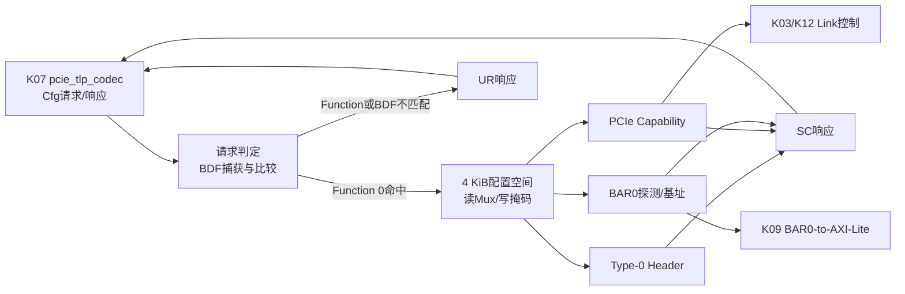

# K08 Type-0 配置空间架构冻结

状态：**K08-CFG-SPACE-v1 架构冻结**

## 1. 本阶段职责

`pcie_cfg_space`位于`phy_coreclk`（250 MHz）域，接收K07冻结的结构化配置请求，
实现单Function Endpoint的4 KiB配置空间。职责固定为：

1. 实现Type-0 Header、PCI Express Capability和BAR0；
2. 第一次合法Function 0配置访问时捕获目标BDF，后续严格比较；
3. 支持所有配置DWORD的读取、可写位掩码和逐Byte Enable写入；
4. 实现4 KiB、32-bit、non-prefetchable BAR0的探测和地址分配；
5. 输出K09需要的BAR0基址、Probe状态、Memory Space Enable和捕获BDF；同时输出
   MPS、MRRS和RCB供状态展示及未来主动Requester使用；
6. 输出K03/K12后续集成需要的Link Disable、Retrain脉冲和目标链路速率；
7. 把请求转换为SC或UR响应，并在反压期间保持响应稳定；
8. 区分PERST#域复位、Hot Reset和普通链路重训。

K08不解析或编码TLP，不实现BAR命中、AXI4-Lite、Memory Completion、DMA、MSI/
MSI-X、AER、ASPM、SR-IOV、FLR、扩展Capability或主动Memory Request。TLP属于K07，
BAR访问属于K09，Gen3训练控制属于K12。

## 2. 数据与控制路径



模块内部只保留一个响应槽。`cfg_req_ready`仅在响应槽空闲时为1；请求握手后的下一拍
最早产生`cfg_rsp_valid`。没有配置请求队列，也不允许第二个请求越过正在反压的响应。

## 3. BDF捕获和路由

- PERST#或Hot Reset后`bdf_valid=0`、`captured_bdf=0`；普通Recovery/速率切换不清除；
- `cfg_req_target_bdf[2:0] != 0`表示未实现Function，返回UR且不得捕获BDF；
- `bdf_valid=0`且Function为0时，第一次请求捕获完整Bus/Device/Function；Device Number
  由Root Port分配，允许为任意5-bit值；
  该请求正常执行；
- `bdf_valid=1`后只有目标BDF完全相等的请求正常执行，其他请求返回UR；
- 首次请求的SC Completion使用该请求目标BDF作为Completer ID；后续响应使用捕获BDF；
- `local_completer_id`在BDF有效前为0，有效后等于`captured_bdf`，供K07内部UR/CA使用。

这一规则利用点到点Endpoint只接收本链路配置事务的前提。K11完整集成仍需证明错误
BDF不会被PHY/MAC错误广播到本Function。

## 4. 配置空间固定映射

所有未列出的DWORD读为0、写忽略。扩展配置空间`0x100～0xfff`全部为0，因此扩展
Capability链为空。

| Byte地址 | 名称 | 复位/固定值 | 写规则 |
|---:|---|---:|---|
| `0x000` | Device/Vendor ID | `e001_1234` | 只读 |
| `0x004` | Status/Command | `0010_0000` | Command仅`[10,8,6,2:0]`可写；Status只读 |
| `0x008` | Class/Revision | `ff00_0001` | 只读 |
| `0x00c` | BIST/Header/Latency/Cache | `0000_0000` | 只读，Header Type 0 |
| `0x010` | BAR0 | `0000_0000` | 4 KiB、32-bit Memory、non-prefetchable |
| `0x014～0x024` | BAR1～5 | `0000_0000` | 未实现，写忽略 |
| `0x028` | CardBus CIS | `0000_0000` | 未实现 |
| `0x02c` | Subsystem ID/Vendor | `e001_1234` | 只读 |
| `0x030` | Expansion ROM BAR | `0000_0000` | 未实现 |
| `0x034` | Capability Pointer | `0000_0040` | 只读 |
| `0x038` | Reserved | `0000_0000` | 写忽略 |
| `0x03c` | Interrupt/Grant/Latency | `0000_0000` | 无INTx |
| `0x040` | PCIe Cap Header | `0002_0010` | ID=`10`、Next=`00`、Version 2、Endpoint |
| `0x044` | Device Capabilities | `0000_0000` | MPSS=128 B，无FLR/Extended Tag |
| `0x048` | Device Control/Status | `0000_2000` | Control`[4:0]`及MRRS`[14:12]`可写；MPS固定0 |
| `0x04c` | Link Capabilities | `0010_0013` | Gen3 x1、无ASPM、DLL Active Reporting |
| `0x050` | Link Control/Status | 动态 | RCB、Disable、Common Clock、Extended Sync、HAWD可写；Retrain为脉冲 |
| `0x054～0x060` | Slot/Root寄存器 | `0000_0000` | Endpoint未实现 |
| `0x064` | Device Capabilities 2 | `0000_0000` | 无新增能力 |
| `0x068` | Device Control/Status 2 | `0000_0000` | 写忽略 |
| `0x06c` | Link Capabilities 2 | `0000_000e` | 支持2.5/5.0/8.0 GT/s |
| `0x070` | Link Control/Status 2 | `0000_0003` | Target Link Speed接受1/2/3，其他值忽略 |
| `0x074～0x0ff` | 未实现Capability空间 | `0000_0000` | 写忽略 |
| `0x100～0xfff` | 扩展配置空间 | `0000_0000` | 无扩展Capability |

### 4.1 Command和Device Control

- Command可写位：I/O Space、Memory Space、Bus Master、Parity Error Response、
  SERR Enable和Interrupt Disable；只有Memory Space与Bus Master对外输出；
- Status固定只置Capabilities List位，当前阶段没有W1C错误状态；
- Device Control错误报告/Relaxed Ordering位可读写但不产生额外功能；
- Max Payload Size固定为0，即128 B；写入其他值不得改变；
- Max Read Request Size复位为2，即512 B，只接受0～5；保留编码6/7保持旧值；K09只接收请求，
  该值用于状态和未来主动请求，不影响K09读取上限。

### 4.2 Link寄存器

- Link Status由`link_up/link_training/dll_active/link_speed/link_width`实时生成；
- Current Link Speed在线路寄存器编码为1/2/3，内部`link_speed`仍使用0/1/2；
- Current Link Speed与`link_up`无关；非法内部编码3按Gen1报告；
- Negotiated Width仅在`link_up=1 && link_width=1`时报告x1，否则报告0；不会报告x2以上；
- Link Control的Retrain位不存储，合法写1时输出单周期`retrain_link_pulse`；
- Link Disable和Target Link Speed输出给后续链路模块；RCB表示本Function作为Requester
  接收Completion时的边界，只保留给未来主动Requester，不控制K09的出站Completion；
- Target Link Speed内部输出保持0=Gen1、1=Gen2、2=Gen3的项目统一编码。

## 5. BAR0行为

BAR0属性冻结为4 KiB、32-bit、non-prefetchable：

```text
Size mask = 0xffff_f000
Address bits = BAR0[31:12]
Attribute bits [3:0] = 0000
```

- 全DWORD写`ffff_ffff`进入`bar0_probe_active`，读回`ffff_f000`；
- 探测期间保留上一次真实`bar0_base`，不把全1传播到K09；
- 任意非探测写按Byte Enable合并后，仅保存`[31:12]`并退出探测；
- 低12位永远读0；BAR1～5和Expansion ROM始终读0；
- `memory_space_enable=0`时K09必须禁止命中；探测期间即使MSE错误保持1，K09也必须
  以`bar0_probe_active`禁止访问。

## 6. 状态机、缓冲和错误处理

状态等价为一个单项响应寄存器：

```text
IDLE --cfg_req handshake--> RESPONSE --cfg_rsp handshake--> IDLE
```

- 响应槽保存`status/rdata/completer_id`，反压时全部稳定；
- 正常读写返回SC；Function或已捕获BDF不匹配返回UR；
- 配置空间保留地址不是错误，读0、写忽略并返回SC；
- K07已经拦截Malformed、Poisoned CfgWr和非法Type/Fmt，K08不重复解析；
- PERST#清除Command、BAR、Device/Link Control、BDF和未完成响应；
- Hot Reset清除可写配置状态与BDF，但不得撤销已经产生的响应；若响应正在反压，响应
  槽保持到握手完成。若Hot Reset与`cfg_rsp_ready=1`同拍到达，该拍完成既有响应握手并
  清空响应槽；`hot_reset=1`期间`cfg_req_ready=0`，因此不会接受无法完成的新请求；
- 普通链路重训、Gen1/Gen3速率切换和DLL Active变化不得清除配置空间；
- 数据阵列深度为0；仅使用寄存器和组合读Mux，不推断BRAM/DSP/PCIe Hard Block。

## 7. 集成边界

K08单元验证直接驱动结构化Cfg接口；枚举验证使用`pcie_tlp_codec + pcie_cfg_space`
集成顶层，并由cocotbext-pcie Root Complex通过一个TLP级`SimPort`适配器收发Packet。
适配器只替代K00～K06的链路传输，不替代K07解码或K08寄存器行为。

K09只能使用本文件冻结的`bar0_base/bar0_probe_active/memory_space_enable`等输出，不能
窥探K08内部寄存器。任何寄存器位定义、BDF规则、BAR大小或复位语义变化都必须升级
`K08-CFG-SPACE-v1`并重跑K07、K08及后续集成回归。
