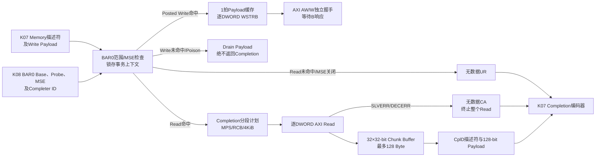

# K09 BAR0-to-AXI4-Lite 架构冻结

状态：**PASS / K09-BAR-AXIL-v1 已冻结**

生产实现为`rtl/tl/pcie_bar_axil_master.sv`；实际回归、时序和已知限制见
`docs/reports/k09-bar-axil-master.md`。

## 1. 本阶段职责与边界

`pcie_bar_axil_master`位于`phy_coreclk`（250 MHz）域，连接K07的结构化Memory
Request、K08的BAR/配置状态、K07的通用Completion输入和一个32-bit AXI4-Lite
Master。职责固定为：

1. 对32-bit、4 KiB、non-prefetchable BAR0执行完整地址范围命中；
2. 将Memory Write的1～32 DW Payload按DWORD转换为顺序AXI4-Lite写访问；
3. 将Memory Read的1～1024 DW转换为顺序AXI4-Lite读访问；
4. 将成功读数据按MPS=128 B、Endpoint固定RCB=128 B和4 KiB边界拆成CplD；
5. 正确计算每个CplD的Length、Byte Count和Lower Address；
6. 将未命中/MSE关闭的Read转换为UR，将AXI Read错误转换为CA；
7. 对Posted Write严格禁止Completion，并记录丢弃、Poisoned和AXI错误。

K09不解析/编码TLP，不访问配置寄存器，不实现AXI Slave、DMA、MSI/MSI-X、AER、
原子操作、乱序、多个Outstanding或主动Memory Request。K07已经完成TLP格式和4 KiB
合法性检查；K10才提供Demo AXI4-Lite Slave，K11才做完整链路集成。

## 2. 数据路径



## 3. 单事务状态机与缓冲

第一版刻意只允许一个Memory Request在K09中执行，状态分为：

```text
IDLE
  |-- Write hit --> W_FETCH -> W_AXI_REQ -> W_AXI_RESP --+
  |                         ^                    |        |
  |                         +-- next DWORD ------+        +-> IDLE/next beat
  |-- Write drop -> W_DRAIN --------------------------------> IDLE
  |-- Read hit --> R_PLAN -> R_AXI_REQ -> R_AXI_RESP --+
  |                                                    |成功
  |                                                    v
  |                 +<-- next chunk -- CPL_DATA <- CPL_DESC
  |                                                    ^
  `-- Read miss -------------------------------------> UR
                         AXI Read error -------------> CA
```

- Write侧只有一个128-bit Payload Beat缓存，最多保存4个DWORD；缓存处理完才接收下一拍；
- Read侧使用`32 × 32-bit`、不复位的数据缓存，恰好容纳一个128 B Completion；
- 描述符、BAR基址、Probe、MSE和Completer ID在`mem_req`握手时原子锁存；事务执行期间
  K08寄存器变化不改变已经接受的请求；
- `hot_reset=1`只禁止接受新描述符，已经握手的事务必须完成或按既定错误路径收尾，
  避免K07停在Payload/Completion半包状态；PERST#才取消全部进行中状态；
- 所有`valid`在反压期间保持，AXI AW与W分别记录握手，禁止假设二者同拍Ready。

## 4. BAR0命中规则

请求命中必须同时满足：

1. `memory_space_enable=1`且`bar0_probe_active=0`；
2. 地址高32位为0（BAR0是32-bit BAR；4DW请求若实际地址低于4 GiB仍可命中）；
3. 首DWORD的`address[31:12]`等于锁存的`bar0_base[31:12]`；
4. `address + 4*LengthDW - 1`不溢出32-bit且仍处于同一个4 KiB BAR窗口；
5. Length合法：Read为1～1024 DW，Write为1～32 DW。

AXI地址固定输出BAR相对地址，`m_axil_{aw,ar}addr[31:12]=0`。按K08已冻结契约，BAR
探测期间即使MSE意外保持1也必须禁止访问；因此`bar0_probe_active`参与命中快照。
Read未命中/MSE关闭/Probe/非法范围返回一个无数据UR；Posted Write在同类错误下只
Drain Payload并计数，绝不返回Completion。

## 5. Memory Write执行

- 每个Payload DWORD对应一次32-bit AXI4-Lite写；地址从BAR相对偏移按4递增；
- Length=1时WSTRB=`FirstBE`；Length>1时首DW用`FirstBE`、末DW用`LastBE`、
  中间DW用`4'hf`；`wdata`不做字节交换；
- AWVALID和WVALID可独立握手，二者都握手后才等待BVALID；BREADY只在等待响应时有效；
- `OKAY/EXOKAY`视为成功，`SLVERR/DECERR`使剩余Payload进入Drain，不再产生新AXI
  副作用；由于Memory Write是Posted，错误只形成计数/脉冲；
- Length=1且FirstBE=0是合法零长度Write：Drain一个Payload DW但不访问AXI、不计错误；
- Poisoned Write、BAR miss、MSE关闭、Probe或Payload keep/last协议错误都Drain到
  `mem_w_last`；
- 任何Write路径，包括成功、失败和Poisoned，都不允许拉高`cpl_req_valid`。

## 6. Memory Read与Completion拆分

K08固定MPS=128 B，因此每个CplD最多32 DW。PCIe Endpoint作为Completer的RCB固定为
128 B；K08 Link Control中的RCB位描述本Function作为Requester时希望收到的Completion，
本项目不主动发Memory Read，K09不得误用该位。设当前DWORD地址为`A`、剩余DWORD为
`R`，本次分段长度固定为：

```text
dw_to_rcb    = 32 - ((A >> 2) mod 32)
dw_to_4k     = 1024 - A[11:2]
R <= 32      : chunk_dw = min(R, dw_to_4k)       # 首包也是末包，可跨RCB
R >  32      : chunk_dw = min(32, dw_to_rcb, dw_to_4k)
```

每个Chunk先把全部DWORD顺序读入缓存；只有全部AXI响应成功后才向K07提交描述符，
因此不会先发送半个SC Completion再发现本Chunk AXI错误。任一AXI Read的
`SLVERR/DECERR`终止整个原请求，并返回一个Length=0、Byte Count=0的无数据CA。

Completion Byte Count计算的是首个有效Byte到最后有效Byte的**地址跨度**，不是BE的
`popcount`；一/二DWORD允许的非连续BE中间空洞也计入跨度。定义`first_off`为FirstBE
最低置位Byte偏移，`last_tail`为LastBE最高置位Byte之后的禁用Byte数：

```text
LengthDW == 1 && FirstBE == 0: 1
LengthDW == 1 && FirstBE != 0: 4 - first_off - first_tail
LengthDW > 1                  : 4*LengthDW - first_off - last_tail
```

- 每个CplD的`Byte Count`是从本CplD起、原请求尚未完成的字节跨度；逻辑4096由K07
  在线路Length字段编码为0；SC CplD的Byte Count始终为1～4096；
- 首个CplD的`Lower Address=(RequestAddress + FirstBE最低置位偏移)[6:0]`；
- 后续CplD从自然128 B边界开始，Endpoint生成时`Lower Address=0`；
- `Length`是Payload覆盖的完整DWORD数，可能包含首尾BE未请求的字节；这些未请求字节
  固定清零，便于确定性验证；
- 零长度Read不访问AXI，返回一个dummy零DWORD：Length=1、Byte Count=1、
  `Lower Address=RequestAddress[6:0]`；
- Payload首DWORD位于`cpl_data[31:0]`，最后一拍keep按1/2/3/4 DWORD分别为
  `000f/00ff/0fff/ffff`；
- SC CplD保持原Requester ID、Tag、TC、Attr，Completer ID取描述符握手时的K08值。

## 7. 错误处理与统计

完成状态固定为`000=SC`、`001=UR`、`100=CA`。无数据UR/CA的BCM、Byte Count、
Lower Address、Length均为0。K09提供一拍诊断脉冲和饱和32-bit计数：Memory Request、
Read、Write、AXI Read、AXI Write、SC Completion、UR、CA、Posted Drop、Poisoned Write、
AXI Read Error、AXI Write Error及Payload Protocol Error。

计数以描述符握手、AXI响应握手或Completion描述符握手为明确事件。计数到
`32'hffff_ffff`后保持，不回绕。PERST#清零；Hot Reset不清零，便于K10/K14诊断。

## 8. 延迟、复位与变更规则

- 最短Read至少经历分段计划、AR、R、Completion描述符四个阶段，不冻结绝对拍数；
- AXI和Completion可无限反压，期间地址、数据、WSTRB、状态和上下文必须稳定；
- `rst_n=0`异步取消全部valid、状态和统计；缓存内容无定义且不做阵列复位；
- 复位释放由K01保证在`phy_coreclk`同步；K09内部无CDC；
- 目标时钟4.000 ns；禁止组合`valid-ready-valid`环路；
- 改变单Outstanding、BAR大小、AXI地址语义、拆分算法、Byte Count/Lower Address、
  Posted/错误策略或复位语义时，必须升级`K09-BAR-AXIL-v1`并重跑K07～K09回归。
