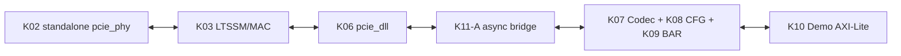
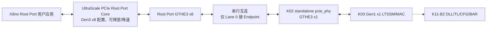

# K11-B 真实 PHY/VCS 串行集成架构

状态：**K11-B1 已冻结并 PASS；K11-B2全部非实板验证 PASS并冻结，实板延期**

依赖接口：`K02-PHY32-v1.1`、`K03-MAC16-v1`、`K11A-OFFLINE-v1`

## 1. 目标与分阶段边界

K11-B 用真实 Xilinx 收发器仿真模型替代行为 PHY Partner，并复用本机 XDMA 工程
导出的 UltraScale Root Port。为避免把物理训练问题和事务层问题混在一起，冻结为
两个连续子门：

- **K11-B1**：Root Port GT 串行端连接 K02 standalone `pcie_phy`，上层只接 K03
  LTSSM/MAC；验收点为双方进入 Gen1 x1 L0；
- **K11-B2**：在 B1 链路上接入 K04～K11-A 的 DLL、TLP、配置空间、BAR 和 Demo
  AXI-Lite Slave；验收点为 Root Port 完成枚举和 BAR 读写。

K11-B1 不宣称完成枚举，不以 Root Port 用户应用的配置读写结果作为通过条件。K11-B2
未通过前，K11 整体仍处于进行中。

## 2. K11-B2 生产层次冻结

新增可综合顶层 `kcu105_pcie_ep_gen1_top`，只完成现有冻结模块的连接，不在集成层
重新解释 TLP、DLLP 或配置寄存器：

- `phy_pclk`只驱动K03、K06和桥的PIPE侧；`phy_coreclk`只驱动桥的Core侧及K07～K10；
- K03 RX Packet直接进入K06，K06 TX Packet直接返回K03，不增加字节重排或弹性缓存；
- K06 `recovery_req`连接K03 `force_recovery`；K03 `hot_reset_seen`作为PIPE域单拍送入
  K11-A的Hot Reset CDC；
- `link_up`表示物理层L0；外部`dll_active`单独表示InitFC完成。B2仿真门禁同时要求
  Endpoint `link_up && dll_active`和Root Port `user_lnk_up`；
- 配置空间捕获首次有效目标BDF，BAR0仍为4 KiB、32-bit、non-prefetchable；
- Demo AXI-Lite保持内部连接，不增加DMA、MSI或主动Memory Request；
- RX/TX Packet FIFO仍为512个128-bit beat，元数据和信用事件FIFO仍为16项；
- TX Packet FIFO与DLL Replay之间增加一个PIPE域一拍弹性寄存器；允许消费旧拍时同拍
  装入新拍，EOP握手时才消费对应metadata，不改变包顺序、字节序或反压语义；
- PERST#清空全部域；速率切换只复位PIPE域，不能清空配置空间；Hot Reset只按K08契约
  复位配置状态。

错误处理保持各冻结模块原语义：坏LCRC产生NAK而不提交TL，Replay fatal请求Recovery，
未支持请求返回UR，AXI读错误返回CA，CDC sticky错误任一置位均使B2失败。

## 3. 仿真拓扑

- Root Port 保持其生成时的 Gen3 x8 配置，以验证真实的降速、降宽训练；
- Endpoint 只连接 Root Port Lane 0；Root Port Lane 1～7 RX 固定为差分静默值；
- 两端使用独立、同频 100 MHz 差分参考时钟，模拟 Common Clock 架构；
- `sys_rst_n` 同时驱动 Root Port reset 与 Endpoint PERST#；
- 顶层模块名固定为 `board`，Root Port 实例名固定为 `RP`，满足 Xilinx 用户应用内
  已存在的层次引用。

## 4. 复用和版本边界

- Root Port 源码只读复用
  `/home/wx/Documents/XDMA/xdma_dec_250922/imports`，不复制、不修改；
- Endpoint PHY 使用本工程 Tcl 确定性生成的 `pcie_phy_x1_gen3`；
- Xilinx 预编译库使用 `/home/wx/Documents/vcs_compile_simlib`；
- 每次运行创建独立临时 VCS work library，避免 `AN.DB` 锁污染；
- K03 硬件超时默认值不变，测试顶层只通过参数覆盖缩短仿真等待。

## 5. 可观测性和失败归因

测试平台记录 Endpoint `ltssm_state/link_up/timeout_count/training_error_count`，并通过
Root Port `cfg_ltssm_state` 交叉确认。B1 尚未接入 InitFC/DLL，故 Xilinx
`user_lnk_up` 只记录、不作为纯 LTSSM 门禁；该信号从 B2 开始纳入验收。通过条件为：

1. Endpoint 进入状态 10（L0）；
2. Root Port `cfg_ltssm_state=6'h10`（L0）；
3. Endpoint 协商结果为 Gen1 x1；
4. 连续观察窗口内两端均未掉链。

失败按最早异常分为参考时钟/复位、Receiver Detect、Polling、Configuration、L0
稳定性五类，日志保留双方最后状态和三个 Endpoint 错误计数器。

## 6. K11-B2 验收事务

Root Port进入`user_lnk_up`后由板级测试平台依次发起：

1. Type-0读取DW0，必须返回`32'hE001_1234`；
2. BAR0写全1并读回，必须返回`32'hFFFF_F000`；
3. BAR0分配到`32'h8000_0000`，Command.MSE置1；
4. 读取BAR0 `0x000`，必须返回签名`32'h5043_4945`；
5. 向Scratch `0x040`写入`32'hA5C3_7E19`并读回一致；
6. 检查Endpoint捕获BDF有效、BAR0/MSE正确、CDC错误为0，且全过程无掉链。

第一版只跑上述单DW事务以缩小串行联调变量；8/16-bit BE、随机BAR访问和错误注入
仍由K08～K10离线回归覆盖，B2基础路径通过后再增加串行随机回归。

## 7. 板级实现封装

`kcu105_pcie_ep_gen1_board_top`只导出KCU105已冻结的REFCLK、PERST#、x1串行口和
8个LED，内部实例化不改变协议逻辑的`kcu105_pcie_ep_gen1_top`。生产顶层的BDF、BAR、
DLL和CDC状态继续保留供仿真/ILA使用，但不作为未约束的板级输出管脚。
