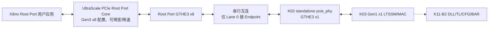

# K11-B 真实 PHY/VCS 串行集成架构

状态：**架构冻结，正在实施 K11-B1（Gen1 x1 L0）**

依赖接口：`K02-PHY32-v1.1`、`K03-MAC16-v1`、`K11A-OFFLINE-v1`

## 1. 目标与分阶段边界

K11-B 用真实 Xilinx 收发器仿真模型替代行为 PHY Partner，并复用本机 XDMA 工程
导出的 UltraScale Root Port。为避免把物理训练问题和事务层问题混在一起，冻结为
两个连续子门：

- **K11-B1**：Root Port GT 串行端连接 K02 standalone `pcie_phy`，上层只接 K03
  LTSSM/MAC；验收点为双方进入 Gen1 x1 L0；
- **K11-B2**：在 B1 链路上接入 K04～K11-A 的 DLL、TLP、配置空间、BAR 和 Demo
  AXI-Lite Slave；验收点为 Root Port 完成枚举和 BAR 读写。

K11-B1 不宣称完成枚举，不以 Root Port 用户应用的配置读写结果作为通过条件。K11-B2
未通过前，K11 整体仍处于进行中。

## 2. 仿真拓扑

- Root Port 保持其生成时的 Gen3 x8 配置，以验证真实的降速、降宽训练；
- Endpoint 只连接 Root Port Lane 0；Root Port Lane 1～7 RX 固定为差分静默值；
- 两端使用独立、同频 100 MHz 差分参考时钟，模拟 Common Clock 架构；
- `sys_rst_n` 同时驱动 Root Port reset 与 Endpoint PERST#；
- 顶层模块名固定为 `board`，Root Port 实例名固定为 `RP`，满足 Xilinx 用户应用内
  已存在的层次引用。

## 3. 复用和版本边界

- Root Port 源码只读复用
  `/home/wx/Documents/XDMA/xdma_dec_250922/imports`，不复制、不修改；
- Endpoint PHY 使用本工程 Tcl 确定性生成的 `pcie_phy_x1_gen3`；
- Xilinx 预编译库使用 `/home/wx/Documents/vcs_compile_simlib`；
- 每次运行创建独立临时 VCS work library，避免 `AN.DB` 锁污染；
- K03 硬件超时默认值不变，测试顶层只通过参数覆盖缩短仿真等待。

## 4. 可观测性和失败归因

测试平台记录 Endpoint `ltssm_state/link_up/timeout_count/training_error_count`，并通过
Root Port `cfg_ltssm_state` 交叉确认。B1 尚未接入 InitFC/DLL，故 Xilinx
`user_lnk_up` 只记录、不作为纯 LTSSM 门禁；该信号从 B2 开始纳入验收。通过条件为：

1. Endpoint 进入状态 10（L0）；
2. Root Port `cfg_ltssm_state=6'h10`（L0）；
3. Endpoint 协商结果为 Gen1 x1；
4. 连续观察窗口内两端均未掉链。

失败按最早异常分为参考时钟/复位、Receiver Detect、Polling、Configuration、L0
稳定性五类，日志保留双方最后状态和三个 Endpoint 错误计数器。
