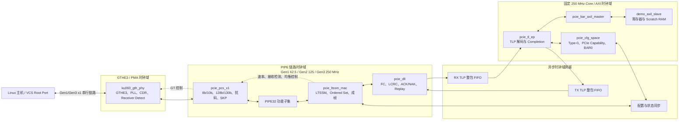

# 系统架构基线

状态：**M00 已冻结**  
目标器件：`xcku060-ffva1156-2-i`，PCIe Gen3 x1 Endpoint  
首个硬件里程碑：PCIe Gen1 x1 枚举与 BAR0 访问

## 设计边界

数据通路为：

`PCIe 串行管脚 -> GTHE3 PMA -> 自研 PCS -> PIPE32 -> LTSSM/MAC -> DLL -> TLP/配置空间 -> BAR-to-AXI4-Lite`

只允许 GT Wizard/GTHE3 和普通 FPGA 原语承担厂商器件功能。PCS、LTSSM、
链路成帧、流量控制、重放、TLP 处理、配置空间和 BAR 地址转换全部采用独立
自研 RTL。

## 时钟与复位归属

| 时钟域 | 标称频率 | 来源 | 所属逻辑 |
|---|---:|---|---|
| GT 参考时钟 | 100 MHz | 封装管脚 P6 的 PCIe 差分参考时钟 | GT Common/Channel |
| PIPE | 62.5/125/250 MHz | GT/PHY 用户时钟网络 | PCS、LTSSM/MAC、DLL |
| Core | 250 MHz | P26 上的 `sys_clk_100` 经 MMCM 产生 | TL、配置空间、BAR Bridge、AXI-Lite |

`pcie_perst_n` 对所有时钟域异步置位复位。只有在本时钟域时钟稳定且必要的
锁定信号有效后，复位才允许在该时钟域同步释放。TLP 只能通过整包异步 FIFO
跨越 PIPE/Core 时钟域。单比特配置和状态使用明确的 CDC 同步器，或使用
请求/应答握手跨域。

## 物理连接基线

- Endpoint lane 0：顶层 `pcie_mgt_1_[rx/tx]p/n[0]`。
- GT 位置：`GTHE3_CHANNEL_X1Y15`。
- GT Common：`GTHE3_COMMON_X1Y3`。
- PCIe 参考时钟 P 管脚：`P6`。
- PERST#：`L24`，LVCMOS18，低有效。
- 本地系统时钟：`P26`，LVCMOS18，100 MHz。

以上信息来自已经完成布线的 KU060 XDMA checkpoint，M03 阶段不得重新选择
这些位置。

## 固定功能配置

- 单 Physical Function，Type-0 配置头。
- Vendor/Device ID 为 `1234:e001`，Class Code 为 `ff0000`，Revision 为 `01`。
- BAR0 为 4 KiB、32-bit、non-prefetchable；不实现 BAR1～5 和 Expansion ROM。
- PCIe Capability 宣告 Gen3 x1，Maximum Payload 为 128 Byte。
- 本版本不实现 DMA、上行 Memory Request、MSI/MSI-X、AER、ASPM、FLR、
  SR-IOV、lane reversal 和多 lane。
- 完成并冻结 Gen1 x1 后才允许编写 Gen3 RTL。

## 模块依赖顺序

`M01 时钟复位 -> M02 Packet CDC -> M03 GT -> M04 Gen1/2 PCS -> M05 Gen1 LTSSM/MAC -> M06 CRC -> M07 Flow Control -> M08 Replay -> M09 TLP Codec -> M10 配置空间 -> M11 BAR/AXI -> M12 Demo Slave -> M13 Gen1 集成 -> M14 Gen3 PCS -> M15 Gen3 均衡 -> M16 加固`

任何模块都不得依赖后续模块的实现细节。单元测试中尚未实现的上下游行为由
行为级 Partner Model 提供。

