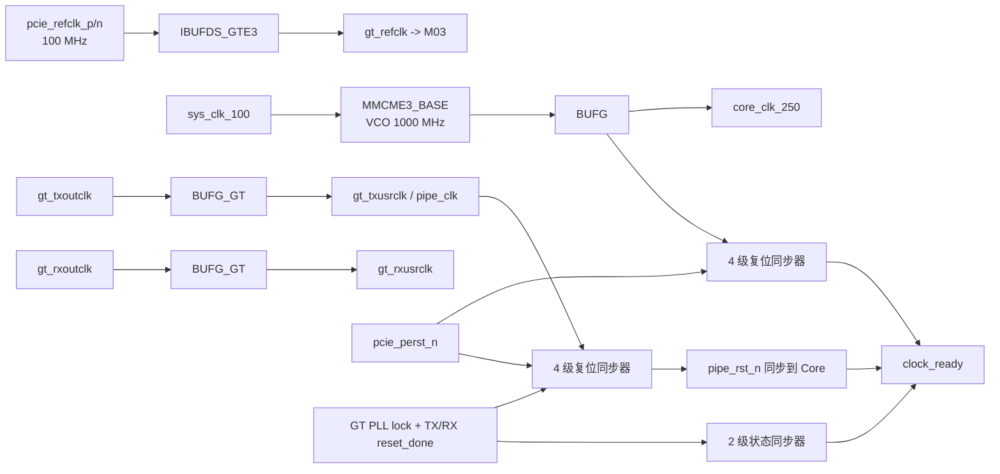

# M01 `pcie_clk_reset` 架构说明

状态：**PASS / M01-v1 已冻结**  
接口版本：M01-v1  
目标器件：`xcku060-ffva1156-2-i`

## 1. 模块职责

M01 负责以下功能：

- 使用 `IBUFDS_GTE3` 缓冲 100 MHz PCIe 差分参考时钟，并向 M03 输出
  `gt_refclk`。
- 使用 `MMCME3_BASE` 将板载 `sys_clk_100` 转换为固定 250 MHz
  `core_clk_250`。
- 使用两个 `BUFG_GT` 分别缓冲 M03 提供的 `gt_txoutclk` 和
  `gt_rxoutclk`，形成 `gt_txusrclk`、`gt_rxusrclk`。
- 将 `gt_txusrclk` 作为统一的 `pipe_clk`。M03 在接收方向负责将 RX 数据可靠
  转换到该 PIPE 时钟域。
- 为 Core 与 PIPE 时钟域产生“异步置位、同步释放”的低有效复位。
- 将 GT 就绪状态同步到 Core 时钟域，并输出软件/调试使用的
  `clock_ready`。

M01 不负责以下功能：

- 不实现 GT PLL、GTHE3 Channel 或 GT 初始化状态机。
- 不产生 GT reset、rate change 或 equalization 控制序列，这些属于 M03。
- 不实现 PCIe LTSSM、数据路径或协议功能。
- 不负责 GT RX 数据到 PIPE TX 用户时钟域的弹性缓冲，这属于 M03/M04。

## 2. 内部结构

## 3. MMCM 参数

输入为 100 MHz，MMCM VCO 固定为 1000 MHz：

- `DIVCLK_DIVIDE = 1`
- `CLKFBOUT_MULT_F = 10.0`
- `CLKOUT0_DIVIDE_F = 4.0`
- `CLKIN1_PERIOD = 10.0 ns`
- `CLKOUT0 = 250 MHz`

MMCM feedback 经过独立 `BUFG` 返回 `CLKFBIN`。`pcie_perst_n=0` 时 MMCM
保持复位；MMCM 失锁会立即重新置位 Core 域复位。

## 4. 复位策略

### Core 域

异步释放条件为：

`core_async_release = pcie_perst_n && core_mmcm_locked`

任一条件撤销时，`core_rst_n` 立即拉低。条件重新满足后，必须经过连续四个
`core_clk_250` 上升沿才允许 `core_rst_n` 拉高。Core 复位不依赖 GT 状态，
因此主机链路尚未建立时配置/TL 时钟域仍可完成自身初始化。

### PIPE 域

异步释放条件为：

`pipe_async_release = pcie_perst_n && gt_pll_lock && gt_tx_reset_done && gt_rx_reset_done`

任一 GT 状态撤销时，`pipe_rst_n` 立即拉低。全部条件恢复后，必须经过连续
四个 `pipe_clk` 上升沿才允许释放。

### `clock_ready`

`clock_ready` 属于 Core 时钟域，只用于状态和启动门控。它仅在以下条件同时
满足时拉高：

- `core_rst_n=1`；
- GT 的三个就绪信号已经通过两级同步器进入 Core 域；
- `pipe_rst_n` 已经通过两级同步器进入 Core 域。

`clock_ready` 的撤销最多允许两个 Core 时钟周期延迟；真正的安全保护由各域
复位负责。

## 5. CDC 与综合约束

- 所有复位同步寄存器标记 `ASYNC_REG=TRUE` 和 `SHREG_EXTRACT=NO`。
- GT 状态和 `pipe_rst_n` 进入 Core 域时使用独立两级同步器。
- `sys_clk_100`、PCIe refclk、TXOUTCLK 和 RXOUTCLK 彼此异步。
- M01 不允许任何多比特数据直接跨时钟域。

## 6. 错误与可观测性

- MMCM 失锁：立即置位 `core_rst_n=0`，`clock_ready=0`。
- 任一 GT ready 信号撤销：立即置位 `pipe_rst_n=0`，随后同步撤销
  `clock_ready`。
- PIPE 时钟停止：PIPE 复位不能释放，`clock_ready` 保持为 0。
- 输出 `core_mmcm_locked`、`core_rst_n`、`pipe_rst_n` 和 `clock_ready`，供
  后续 ILA 采集。
